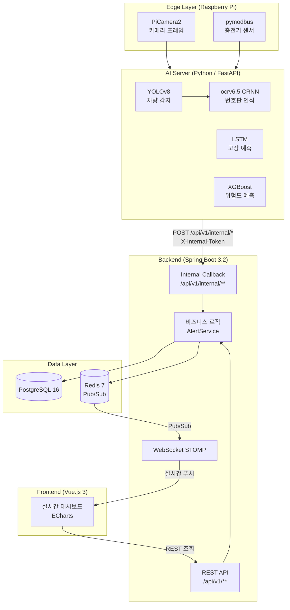
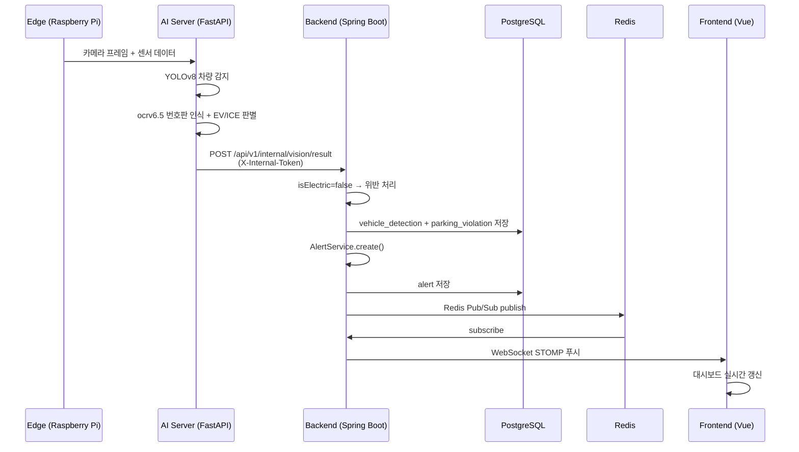
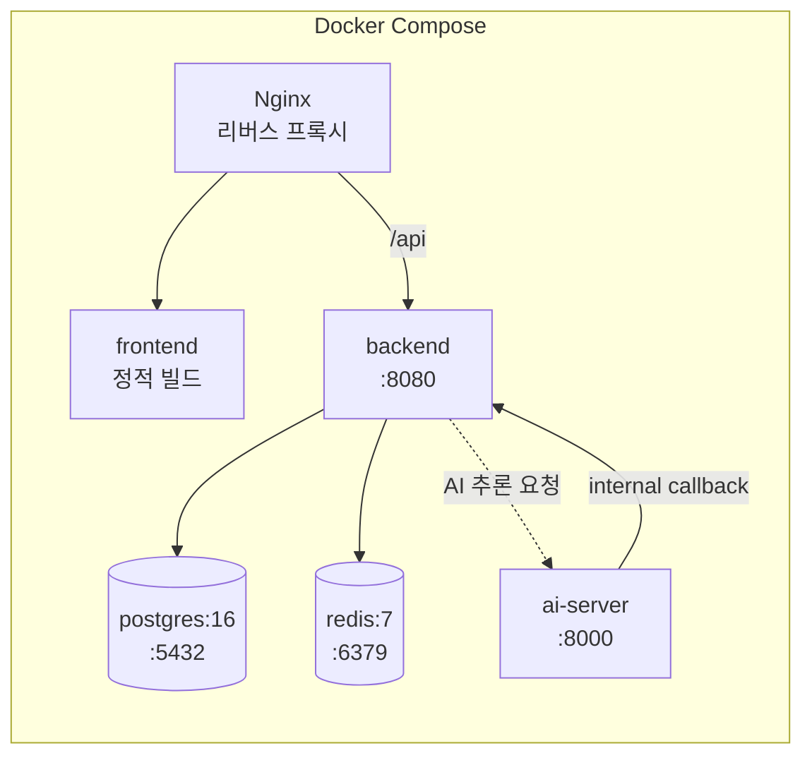

# 프로젝트 개요서 (Project Overview)

> **E-pit AI 기반 스마트 충전소 통합 관제 시스템**
> Hyundai Motor Group E-pit Smart Charging Station Integrated Monitoring System

| 항목 | 내용 |
|------|------|
| 문서 버전 | v1.0 |
| 작성일 | 2026-06-11 |
| 작성자 | 수석 아키텍트 |
| 고객사 | 현대자동차그룹 E-pit (시나리오) |
| 문서 상태 | 확정 (Baseline) |

---

## 1. 프로젝트 배경 및 목적

### 1.1 배경

현대자동차그룹의 초고속 충전 브랜드 **E-pit**은 전국 주요 거점에 350kW급 초고속 충전소를 운영하고 있다. 전기차(EV) 보급이 급증하면서 충전 인프라의 안정적 운영과 고객 경험 향상이 핵심 경쟁력으로 부상하고 있으나, 현장에서는 다음과 같은 운영상 문제가 반복적으로 발생하고 있다.

1. **비전기차(ICE) 충전구역 불법 점유 (ICE-ing)**
   내연기관 차량이 충전 전용 구역을 점유하여 실제 충전이 필요한 EV 고객이 충전을 하지 못하는 사례가 빈번하다. 현재는 현장 순찰 또는 고객 신고에 의존하여 적발이 늦고, 증거 확보가 어렵다.

2. **충전기 돌발 고장으로 인한 가동률 저하**
   충전기 내부 부품(릴레이, 케이블, 냉각 모듈 등)의 열화·고장이 사전 징후 없이 발생하여, 사후 대응(Break-down Maintenance)에 따른 다운타임과 출동 비용이 증가하고 있다.

3. **충전소 인근 교통 위험 상황 대응 미흡**
   충전소 진입로의 차량 정체·기상 악화로 인한 사고 위험이 존재하나, 이를 사전에 인지하고 대응할 수 있는 체계가 없다.

4. **분산된 관제 환경**
   충전소·충전기 상태, 위반 이벤트, 알림이 통합되지 않아 운영자가 다수의 시스템을 오가며 상황을 판단해야 한다.

### 1.2 목적

본 프로젝트는 **AI 기술(컴퓨터 비전 + 시계열 예측 + 머신러닝)** 을 충전소 운영 전반에 적용하여, 다음을 달성하는 **통합 관제 시스템**을 구축하는 것을 목적으로 한다.

- **사전 예방(Proactive)**: 고장이 발생하기 전에 예측하고, 위반이 굳어지기 전에 즉시 감지한다.
- **자동화(Automation)**: 사람의 순찰·점검에 의존하던 업무를 AI가 자동 감지·판단·알림한다.
- **통합 가시성(Single Pane of Glass)**: 모든 충전소·충전기·이벤트를 하나의 대시보드에서 실시간 관제한다.

---

## 2. 시스템 범위 (System Scope)

### 2.1 In-Scope (포함 범위)

| 구분 | 범위 |
|------|------|
| AI 비전 | YOLOv8 차량 감지, ocrv6.5(V5OCR) CRNN 번호판 인식, EV/ICE 판별, 불법주차 위반 처리 |
| AI 예지보전 | 충전기 센서(전압/전류/온도/진동) 수집, LSTM 고장 확률·잔여수명(RUL) 예측 |
| AI 교통예측 | 인근 교통 데이터(차량수/속도/혼잡도) 수집, XGBoost 위험도 예측 |
| 실시간 관제 | WebSocket(STOMP) 이벤트 푸시, ECharts 대시보드 시각화 |
| 자산 관리 | 충전소/충전기 CRUD, 상태 관리, 헬스스코어 관리 |
| 알림 | 위반/고장/교통/시스템 알림 통합 생성·조회 |
| 인증/권한 | JWT 기반 로그인, 역할 기반 접근 제어(ADMIN/OPERATOR/VIEWER) |
| Edge | Raspberry Pi 기반 카메라 프레임·센서 데이터 수집 및 전송 |

### 2.2 Out-of-Scope (제외 범위)

- 실제 충전 결제(PG) 및 정산 시스템 연동
- OCPP(Open Charge Point Protocol) 기반 충전 세션 제어
- 고객용 모바일 앱 (본 시스템은 운영자용 관제 시스템에 한정)
- 위반 차량에 대한 법적 과태료 부과 프로세스 (알림까지만 처리)

---

## 3. 핵심 기능 목록 (5대 기능)

### 기능 1. AI 기반 불법주차 감지 (Illegal Parking Detection)

> 비전기차가 충전 전용 구역을 점유하면 자동으로 감지·증거 확보·알림한다.

- **YOLOv8**로 카메라 프레임에서 차량을 실시간 감지
- **ocrv6.5(V5OCR) CRNN** 모델로 번호판 문자 인식
- 차종(EV/ICE/UNKNOWN) 및 전기차 여부(`isElectric`) 판별 → **판별 책임은 AI 서버**
- Backend는 `isElectric=false` 인 경우 `NON_EV_OCCUPANCY` 위반으로 처리
- 증거 이미지 저장 + 위반 알림 자동 생성

### 기능 2. PHM 예지보전 (Prognostics & Health Management)

> 충전기 고장을 사전에 예측하여 계획 정비로 전환한다.

- 충전기 센서 데이터(전압/전류/온도/진동)를 주기적으로 수집
- **LSTM(PyTorch)** 시계열 모델로 고장 확률 및 **잔여 유효 수명(RUL, Remaining Useful Life)** 예측
- 위험 등급(NORMAL/WARNING/CRITICAL) 산출 + 고장 예상 부품(`predictedComponent`) 식별
- CRITICAL 예측 시 자동 알림 → 계획 정비 유도

### 기능 3. 교통 위험도 예측 (Traffic Risk Prediction)

> 충전소 인근 교통 상황을 분석하여 진입 위험을 사전 경고한다.

- 인근 교통 데이터(차량수/평균속도/혼잡도/기상/노면상태) 수집
- **XGBoost** 모델로 위험 점수 및 등급(LOW/MEDIUM/HIGH/CRITICAL) 예측
- 위험 기여 요인(`contributingFactors`) 분석 제공

### 기능 4. 실시간 통합 관제 (Real-time Integrated Monitoring)

> 모든 이벤트를 단일 대시보드에서 실시간으로 관제한다.

- **WebSocket STOMP** 기반 이벤트 실시간 푸시
- **Redis Pub/Sub** 으로 다중 인스턴스 간 알림 브로드캐스트
- **ECharts** 기반 시각화 대시보드 (현황 카드, 실시간 차트, 지도)

### 기능 5. 충전소/충전기 자산 관리 (Asset Management CRUD)

> 관제 대상 자산을 등록·수정·삭제·조회한다.

- 충전소(충전소코드/위치/카메라장치/운영상태) 관리
- 충전기(커넥터타입/최대출력/상태/헬스스코어) 관리

---

## 4. 기술 스택 (Technology Stack)

| 레이어 | 기술 | 용도 |
|--------|------|------|
| **Backend** | Spring Boot 3.2 | 핵심 비즈니스 로직, REST API |
| | Spring Security 6 + JWT | 인증/인가, 역할 기반 접근 제어 |
| | Spring Data JPA | ORM, 도메인 영속성 |
| | WebSocket (STOMP) | 실시간 이벤트 푸시 |
| | Redis 7 | Pub/Sub, 캐시, 세션 |
| | Flyway | DB 스키마 버전 관리 |
| **AI Server** | Python 3.11 + FastAPI | AI 추론 서버, 내부 콜백 |
| | YOLOv8 | 차량 객체 감지 |
| | ocrv6.5 (V5OCR) CRNN | 번호판 문자 인식(OCR) |
| | LSTM (PyTorch) | 충전기 고장·잔여수명 예측 |
| | XGBoost | 교통 위험도 예측 |
| **Database** | PostgreSQL 16 | 주 데이터 저장소 |
| | Redis 7 | 메시지 브로커, 캐시 |
| **Frontend** | Vue.js 3 | SPA 프레임워크 |
| | Pinia | 상태 관리 |
| | TypeScript | 정적 타입 |
| | Element Plus | UI 컴포넌트 라이브러리 |
| | ECharts | 데이터 시각화 |
| **Edge** | Raspberry Pi | 엣지 디바이스 |
| | PiCamera2 | 카메라 프레임 캡처 |
| | pymodbus | 충전기 센서 Modbus 통신 |
| **Infra** | Docker Compose | 컨테이너 오케스트레이션 |
| | Nginx | 리버스 프록시, 정적 서빙 |

---

## 5. 시스템 아키텍처

### 5.1 전체 아키텍처 다이어그램

### 5.2 데이터 흐름 (시퀀스)

### 5.3 핵심 아키텍처 원칙

1. **Alert 생성은 단일 경로**: 모든 알림은 `AlertService.create(AlertCreateCommand)` 단일 경로로만 생성된다. 저장 + WebSocket 푸시 + Redis Pub/Sub을 캡슐화하여 일관성을 보장한다.
2. **EV 판별 책임은 AI 서버**: Backend는 AI가 내려준 `isElectric` 값을 신뢰하고 위반 여부만 결정한다. 비전 추론 로직이 Backend로 누출되지 않는다.
3. **enum 값은 전 계층 SSOT**: DB CHECK 제약 / JPA `@Enumerated(STRING)` / TypeScript union / pydantic `Literal` 이 동일한 값을 공유한다.
4. **타임존 UTC**: DB는 `TIMESTAMPTZ`로 UTC 저장, 프론트엔드에서 KST 변환 표시한다.
5. **AI 모델 Mock/Real 자동 전환**: 모델 파일이 없으면 Mock 추론, 있으면 실제 모델을 자동 사용하여 개발·운영 환경을 분리한다.
6. **AI→Backend 내부 콜백 보안**: 내부 콜백은 `/api/v1/internal/**` 경로 + `X-Internal-Token` 헤더로만 호출 가능하다.

---

## 6. 배포 토폴로지

---

## 7. 기대 효과

### 7.1 정량적 효과

| 지표 | As-Is | To-Be (목표) |
|------|-------|--------------|
| 불법주차 적발 시간 | 수십 분 (순찰/신고 의존) | **수 초 (자동 감지)** |
| 충전기 다운타임 | 사후 대응 | **예측 기반 30% 절감** |
| 충전기 가동률 | 기준 | **계획 정비로 향상** |
| 위반 증거 확보율 | 낮음 (수기) | **100% (자동 캡처)** |
| 관제 시스템 수 | 다수 분산 | **1개 통합 대시보드** |

### 7.2 정성적 효과

- **고객 경험 향상**: 충전 전용 구역 점유 해소로 EV 고객의 충전 접근성 개선
- **운영 효율화**: 순찰·수동 점검 업무를 AI 자동화로 대체하여 인력 운영 최적화
- **데이터 기반 의사결정**: 축적된 위반·고장·교통 데이터로 충전소 운영 전략 수립
- **확장성**: 신규 충전소 추가 시 Edge 디바이스 등록만으로 관제 범위 확장

---

## 8. 용어 정의

| 용어 | 설명 |
|------|------|
| EV | Electric Vehicle (전기차) |
| ICE | Internal Combustion Engine (내연기관차) |
| ICE-ing | 내연기관차가 EV 충전구역을 점유하는 행위 |
| PHM | Prognostics & Health Management (예지보전) |
| RUL | Remaining Useful Life (잔여 유효 수명) |
| OCR | Optical Character Recognition (광학 문자 인식) |
| CRNN | Convolutional Recurrent Neural Network |
| STOMP | Simple Text Oriented Messaging Protocol |
| SSOT | Single Source of Truth (단일 진실 공급원) |
