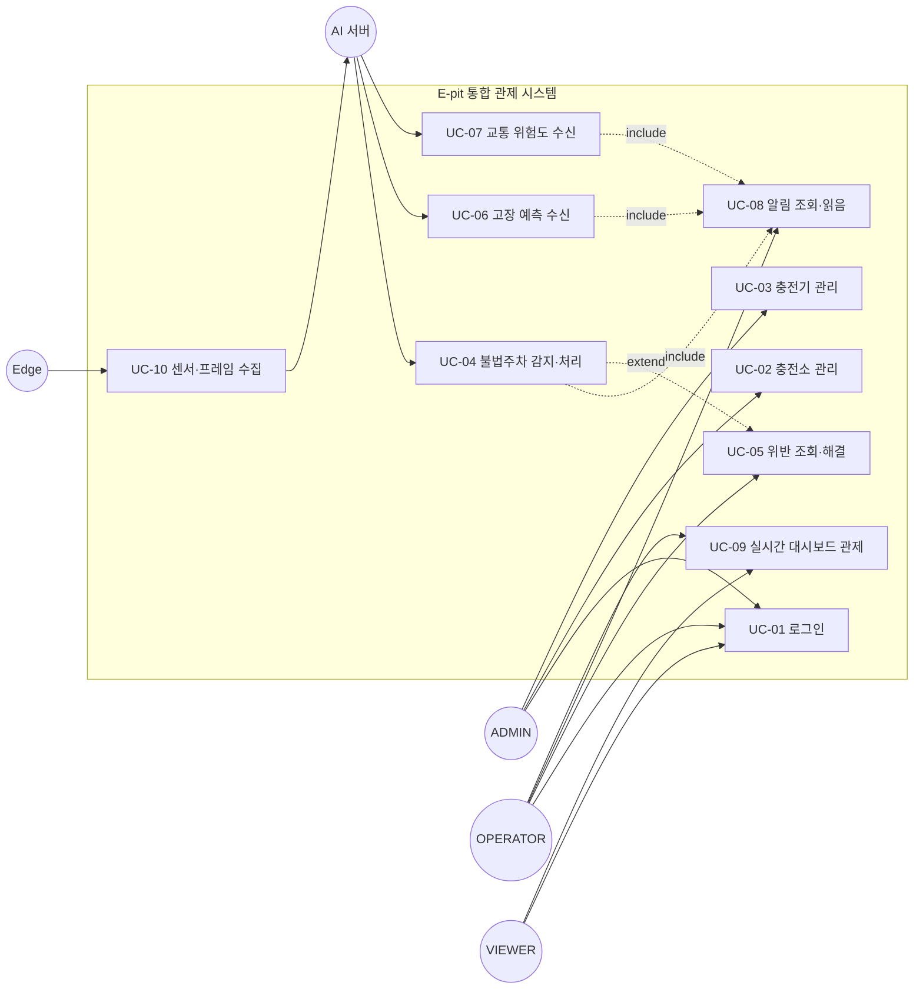

# 유스케이스 명세서 (Use Case Specification)

> **E-pit AI 기반 스마트 충전소 통합 관제 시스템**

| 항목 | 내용 |
|------|------|
| 문서 버전 | v1.0 |
| 작성일 | 2026-06-11 |
| 작성자 | 수석 아키텍트 |
| 문서 상태 | 확정 (Baseline) |

---

## 1. 액터 정의 (Actors)

| 액터 | 유형 | 설명 |
|------|------|------|
| **ADMIN** (관리자) | 인간 | 시스템 최고 권한. 회원 관리, 충전소·충전기 CRUD, 모든 조회·처리 가능 |
| **OPERATOR** (운영자) | 인간 | 관제 담당. 위반 처리, 알림 읽음 처리, 자산 조회/등록 가능 (삭제 제한) |
| **VIEWER** (조회자) | 인간 | 읽기 전용. 대시보드·목록 조회만 가능 |
| **AI 서버** (AI Server) | 시스템 | YOLOv8/OCR/LSTM/XGBoost 추론 후 Backend 내부 콜백 호출 |
| **Edge** (Raspberry Pi) | 시스템 | 카메라 프레임·충전기 센서 데이터를 수집하여 AI 서버로 전송 |

### 1.1 액터별 권한 매트릭스

| 기능 | ADMIN | OPERATOR | VIEWER | AI 서버 | Edge |
|------|:-----:|:--------:|:------:|:-------:|:----:|
| 로그인 | O | O | O | - | - |
| 회원 관리 | O | X | X | - | - |
| 충전소/충전기 등록·수정 | O | O | X | - | - |
| 충전소/충전기 삭제 | O | X | X | - | - |
| 위반 조회 | O | O | O | - | - |
| 위반 처리(RESOLVED) | O | O | X | - | - |
| 예측/알림 조회 | O | O | O | - | - |
| 알림 읽음 처리 | O | O | X | - | - |
| 대시보드 조회 | O | O | O | - | - |
| 비전/PHM/교통 콜백 | - | - | - | O | - |
| 데이터 수집·전송 | - | - | - | (수신) | O |

---

## 2. 유스케이스 다이어그램

---

## 3. 유스케이스 상세 명세

### UC-01. 로그인 (Login)

| 항목 | 내용 |
|------|------|
| **유스케이스 ID** | UC-01 |
| **액터** | ADMIN, OPERATOR, VIEWER |
| **목적** | 사용자가 인증을 통해 JWT 토큰을 발급받아 시스템에 접근한다 |
| **사전조건** | 사용자 계정이 등록되어 있고 `enabled=true` 상태 |
| **사후조건** | JWT 액세스 토큰 발급, 클라이언트 인증 상태 유지 |

**기본 흐름**
1. 사용자가 username/password를 입력한다.
2. 시스템이 `POST /api/v1/auth/login`을 호출한다.
3. 시스템이 비밀번호 해시를 검증한다.
4. 시스템이 역할(role)을 포함한 JWT 토큰을 발급한다.
5. 클라이언트가 토큰을 저장하고 대시보드로 이동한다.

**예외 흐름**
- 3a. 비밀번호 불일치 → 401 반환, "인증 실패" 메시지 표시
- 3b. `enabled=false` 계정 → 403 반환, "비활성 계정" 메시지 표시
- 2a. 필수값 누락 → 400 반환 (검증 오류)

---

### UC-02. 충전소 관리 (Manage Charging Station)

| 항목 | 내용 |
|------|------|
| **유스케이스 ID** | UC-02 |
| **액터** | ADMIN(전체), OPERATOR(등록·수정) |
| **목적** | 관제 대상 충전소를 등록·수정·삭제·조회한다 |
| **사전조건** | 로그인 완료, 적절한 권한 보유 |
| **사후조건** | `charging_station` 레코드 변경, 목록에 반영 |

**기본 흐름 (등록)**
1. 사용자가 충전소 정보(stationCode, name, address, 위경도, totalChargers, cameraDeviceId)를 입력한다.
2. 시스템이 `POST /api/v1/stations`를 호출한다.
3. 시스템이 `stationCode` 유일성을 검증한다.
4. 시스템이 충전소를 저장하고 `operationStatus=ACTIVE`로 초기화한다.
5. 목록에 신규 충전소가 표시된다.

**대안 흐름 (수정/삭제)**
- 수정: `PUT /api/v1/stations/{id}` → 변경 후 저장
- 삭제: `DELETE /api/v1/stations/{id}` (ADMIN 전용)

**예외 흐름**
- 3a. `stationCode` 중복 → 409 Conflict 반환
- 4a. VIEWER가 등록 시도 → 403 Forbidden
- 삭제 시: 연결된 충전기가 존재 → 정책에 따라 차단 또는 cascade 처리

---

### UC-03. 충전기 관리 (Manage Charger)

| 항목 | 내용 |
|------|------|
| **유스케이스 ID** | UC-03 |
| **액터** | ADMIN, OPERATOR(등록) |
| **목적** | 충전소에 속한 충전기를 등록·조회한다 |
| **사전조건** | 대상 충전소가 존재함 |
| **사후조건** | `charger` 레코드 생성, 충전소와 연결 |

**기본 흐름**
1. 사용자가 충전기 정보(chargerCode, connectorType, maxPowerKw)와 소속 station_id를 입력한다.
2. 시스템이 `POST /api/v1/chargers`를 호출한다.
3. 시스템이 소속 충전소 존재 여부를 검증한다.
4. 시스템이 충전기를 `status=AVAILABLE`, `healthScore=100`으로 저장한다.
5. 목록에 충전기가 표시된다.

**예외 흐름**
- 3a. 존재하지 않는 station_id → 404 Not Found
- 2a. 잘못된 connectorType(enum 위반) → 400 Bad Request

---

### UC-04. 불법주차 감지·처리 (Detect Illegal Parking) ★핵심

| 항목 | 내용 |
|------|------|
| **유스케이스 ID** | UC-04 |
| **액터** | AI 서버 (주), Edge (선행) |
| **목적** | 비전기차의 충전구역 점유를 자동 감지하여 위반 처리 및 알림한다 |
| **사전조건** | AI 서버가 YOLOv8 차량 감지 + ocrv6.5 번호판 인식 + EV/ICE 판별 완료 |
| **사후조건** | `vehicle_detection`·`parking_violation` 저장, 알림 생성·푸시 |

**기본 흐름**
1. Edge가 카메라 프레임을 AI 서버로 전송한다. (UC-10 연계)
2. AI 서버가 YOLOv8로 차량을 감지한다.
3. AI 서버가 ocrv6.5(V5OCR) CRNN으로 번호판을 인식한다.
4. AI 서버가 차종(EV/ICE/UNKNOWN)과 `isElectric` 값을 판별한다.
5. AI 서버가 `POST /api/v1/internal/vision/result` (X-Internal-Token)로 콜백한다.
6. Backend가 `X-Internal-Token`을 검증한다.
7. Backend가 `vehicle_detection`을 저장한다.
8. Backend가 `isElectric=false`임을 확인한다.
9. Backend가 `parking_violation`(NON_EV_OCCUPANCY, status=DETECTED)을 생성하고 증거 이미지 경로를 저장한다.
10. Backend가 `AlertService.create()`로 PARKING_VIOLATION 알림을 생성한다. (UC-08 include)
11. Backend가 Redis Pub/Sub + WebSocket STOMP로 실시간 푸시한다.
12. 대시보드가 위반 이벤트를 즉시 표시한다.

**예외 흐름**
- 6a. `X-Internal-Token` 검증 실패 → 401 반환, 콜백 거부
- 8a. `isElectric=true`(전기차) → 위반 미생성, 감지 기록만 저장
- 4a. `vehicleType=UNKNOWN` 또는 번호판 미인식 → 정책에 따라 위반 보류 또는 confidence 임계치 적용
- 11a. Redis 장애 → 알림은 DB에 저장되어 유실 없음(NFR-AVL-04), WebSocket 재연결 시 재조회

---

### UC-05. 위반 조회·해결 (Review & Resolve Violation)

| 항목 | 내용 |
|------|------|
| **유스케이스 ID** | UC-05 |
| **액터** | ADMIN, OPERATOR |
| **목적** | 감지된 위반을 검토하고 처리 완료 상태로 변경한다 |
| **사전조건** | 위반(`parking_violation`)이 존재함 |
| **사후조건** | 위반 상태가 RESOLVED로 변경, `resolvedAt` 기록 |

**기본 흐름**
1. 운영자가 위반 목록을 조회한다. (`GET /api/v1/violations`)
2. 운영자가 상태(DETECTED/NOTIFIED/RESOLVED)로 필터링한다.
3. 운영자가 특정 위반의 증거 이미지를 확인한다.
4. 운영자가 위반을 RESOLVED로 변경한다.
5. 시스템이 `resolvedAt`을 기록하고 상태를 갱신한다.

**예외 흐름**
- 4a. VIEWER가 처리 시도 → 403 Forbidden
- 4b. 이미 RESOLVED인 위반 재처리 시도 → 멱등 처리 또는 409

---

### UC-06. 고장 예측 수신 (Receive Failure Prediction) ★핵심

| 항목 | 내용 |
|------|------|
| **유스케이스 ID** | UC-06 |
| **액터** | AI 서버 (주), Edge (선행) |
| **목적** | LSTM 예측 결과를 수신하여 고장 위험을 기록하고 알림한다 |
| **사전조건** | Edge가 센서 데이터 수집, AI 서버가 LSTM 추론 완료 |
| **사후조건** | `failure_prediction` 저장, 충전기 healthScore 갱신, CRITICAL 시 알림 |

**기본 흐름**
1. Edge가 센서 데이터(전압/전류/온도/진동)를 수집한다. (UC-10)
2. Backend가 `equipment_health`에 센서 데이터를 저장한다.
3. AI 서버가 LSTM으로 고장 확률·잔여수명(RUL)·위험등급을 예측한다.
4. AI 서버가 `POST /api/v1/internal/phm/result`로 콜백한다.
5. Backend가 토큰 검증 후 `failure_prediction`을 저장한다. (failureProbability, remainingUsefulLifeHours, riskLevel, predictedComponent, modelVersion)
6. Backend가 해당 충전기의 `healthScore`를 갱신한다.
7. Backend가 `riskLevel=CRITICAL`이면 EQUIPMENT_FAILURE 알림을 생성한다. (UC-08 include)
8. 대시보드에 위험 충전기가 강조 표시된다.

**예외 흐름**
- 5a. 존재하지 않는 charger_id → 404, 콜백 무시
- 7a. `riskLevel=NORMAL/WARNING` → 알림 미생성, 예측 기록만 저장
- 3a. 모델 파일 부재 → Mock 추론으로 자동 폴백(NFR-AVL-03)

---

### UC-07. 교통 위험도 수신 (Receive Traffic Risk)

| 항목 | 내용 |
|------|------|
| **유스케이스 ID** | UC-07 |
| **액터** | AI 서버 |
| **목적** | XGBoost 교통 위험도 예측을 수신하여 기록하고 위험 시 알림한다 |
| **사전조건** | 교통 데이터(`traffic_data`)가 수집됨, AI 서버 추론 완료 |
| **사후조건** | `risk_prediction` 저장, HIGH/CRITICAL 시 알림 |

**기본 흐름**
1. 시스템이 교통 데이터(vehicleCount/avgSpeedKmh/congestionLevel/weather/roadSurface)를 수집·저장한다.
2. AI 서버가 XGBoost로 위험점수·등급·기여요인을 예측한다.
3. AI 서버가 `POST /api/v1/internal/traffic/result`로 콜백한다.
4. Backend가 토큰 검증 후 `risk_prediction`을 저장한다.
5. Backend가 `riskLevel=HIGH/CRITICAL`이면 TRAFFIC_RISK 알림을 생성한다.
6. 운영자가 `GET /api/v1/stations/{id}/risk/latest`로 최신 위험도를 조회한다.

**예외 흐름**
- 4a. 토큰 검증 실패 → 401
- 5a. `riskLevel=LOW/MEDIUM` → 알림 미생성

---

### UC-08. 알림 조회·읽음 처리 (View & Read Alert)

| 항목 | 내용 |
|------|------|
| **유스케이스 ID** | UC-08 |
| **액터** | ADMIN, OPERATOR(읽음처리), VIEWER(조회) |
| **목적** | 통합 알림을 조회하고 읽음 처리한다 |
| **사전조건** | 알림(`alert`)이 생성되어 있음 |
| **사후조건** | 알림 `isRead` 갱신 |

**기본 흐름**
1. 사용자가 알림 목록을 조회한다. (`GET /api/v1/alerts`)
2. 사용자가 읽음/안읽음, 심각도(INFO/WARNING/CRITICAL)로 필터링한다.
3. 사용자가 알림을 클릭하여 원본 이벤트(referenceType/referenceId)로 이동한다.
4. 사용자가 알림을 읽음 처리한다. (`isRead=true`)

**예외 흐름**
- 4a. VIEWER가 읽음 처리 시도 → 403 Forbidden
- 3a. 참조 원본이 삭제됨 → "원본 없음" 안내

**비고**: 본 유스케이스는 UC-04/06/07에서 `<<include>>`로 호출되어 알림이 자동 생성된다.

---

### UC-09. 실시간 대시보드 관제 (Monitor Real-time Dashboard)

| 항목 | 내용 |
|------|------|
| **유스케이스 ID** | UC-09 |
| **액터** | ADMIN, OPERATOR, VIEWER |
| **목적** | 충전소·충전기·위반·알림 현황을 실시간으로 관제한다 |
| **사전조건** | 로그인 완료 |
| **사후조건** | 신규 이벤트가 실시간 반영됨 |

**기본 흐름**
1. 사용자가 대시보드에 진입한다.
2. 시스템이 `GET /api/v1/dashboard/overview`로 현황 요약을 로드한다.
3. 클라이언트가 WebSocket STOMP 채널을 구독한다.
4. ECharts가 상태 분포·시계열 추이를 렌더링한다.
5. 신규 이벤트 발생 시 WebSocket 푸시로 대시보드가 자동 갱신된다.

**예외 흐름**
- 3a. WebSocket 연결 끊김 → 자동 재연결 시도, 재연결 시 최신 데이터 재조회(NFR-USE-01)
- 2a. 토큰 만료 → 401, 로그인 화면으로 리다이렉트

---

### UC-10. 센서·프레임 수집 (Collect Sensor & Frame)

| 항목 | 내용 |
|------|------|
| **유스케이스 ID** | UC-10 |
| **액터** | Edge (Raspberry Pi) |
| **목적** | 카메라 프레임과 충전기 센서 데이터를 수집하여 AI 서버로 전송한다 |
| **사전조건** | Edge 디바이스가 충전소·충전기에 매핑되어 있음 |
| **사후조건** | AI 서버가 추론 입력을 수신함 |

**기본 흐름**
1. Edge가 PiCamera2로 카메라 프레임을 캡처한다.
2. Edge가 pymodbus로 충전기 센서(전압/전류/온도/진동)를 읽는다.
3. Edge가 데이터를 AI 서버로 전송한다.
4. AI 서버가 추론(UC-04/06/07)을 트리거한다.

**예외 흐름**
- 1a. 카메라 장치 오류 → Edge 로컬 로깅, 재시도
- 3a. AI 서버 연결 실패 → 로컬 버퍼링 후 재전송

---

## 4. 유스케이스 요약

| ID | 유스케이스 | 주 액터 | 핵심 여부 |
|----|-----------|---------|:--------:|
| UC-01 | 로그인 | 전체 사용자 | |
| UC-02 | 충전소 관리 | ADMIN/OPERATOR | |
| UC-03 | 충전기 관리 | ADMIN/OPERATOR | |
| UC-04 | 불법주차 감지·처리 | AI 서버 | ★ |
| UC-05 | 위반 조회·해결 | ADMIN/OPERATOR | |
| UC-06 | 고장 예측 수신 | AI 서버 | ★ |
| UC-07 | 교통 위험도 수신 | AI 서버 | |
| UC-08 | 알림 조회·읽음 | 전체 사용자 | |
| UC-09 | 실시간 대시보드 관제 | 전체 사용자 | ★ |
| UC-10 | 센서·프레임 수집 | Edge | |

> **총 10개 유스케이스** (요구 8개 이상 충족), 기본·예외 흐름 포함
