# ERD 문서 (Entity Relationship Diagram)

> **E-pit AI 기반 스마트 충전소 통합 관제 시스템**

| 항목 | 내용 |
|------|------|
| 문서 버전 | v1.0 |
| 작성일 | 2026-06-11 |
| 작성자 | 수석 아키텍트 |
| 문서 상태 | 확정 (Baseline) |

---

## 1. ERD 다이어그램 (Mermaid)

```mermaid
erDiagram
    MEMBER {
        bigint id PK "GENERATED ALWAYS AS IDENTITY"
        varchar username UK "NOT NULL, 50자"
        varchar password "NOT NULL, BCrypt 해시"
        varchar name "NOT NULL, 50자"
        varchar email UK "NOT NULL, 100자"
        varchar role "NOT NULL, ADMIN|OPERATOR|VIEWER"
        boolean enabled "DEFAULT TRUE"
        timestamptz last_login_at
        timestamptz created_at "DEFAULT now()"
        timestamptz updated_at "DEFAULT now()"
    }

    CHARGING_STATION {
        bigint id PK "GENERATED ALWAYS AS IDENTITY"
        varchar station_code UK "NOT NULL, 20자"
        varchar name "NOT NULL, 100자"
        varchar address "NOT NULL, 255자"
        decimal latitude "NOT NULL, DECIMAL(10,7)"
        decimal longitude "NOT NULL, DECIMAL(10,7)"
        int total_chargers "NOT NULL, DEFAULT 0"
        varchar operation_status "NOT NULL, ACTIVE|MAINTENANCE|CLOSED"
        varchar camera_device_id "50자"
        timestamptz created_at "DEFAULT now()"
        timestamptz updated_at "DEFAULT now()"
    }

    CHARGER {
        bigint id PK "GENERATED ALWAYS AS IDENTITY"
        bigint station_id FK "NOT NULL"
        varchar charger_code UK "NOT NULL, 30자"
        varchar connector_type "NOT NULL, CCS1|CCS2|CHADEMO|AC3"
        int max_power_kw "NOT NULL"
        varchar status "NOT NULL, AVAILABLE|CHARGING|FAULT|OFFLINE|RESERVED"
        decimal health_score "DECIMAL(5,2), 0~100"
        timestamptz last_maintenance_at
        timestamptz created_at "DEFAULT now()"
        timestamptz updated_at "DEFAULT now()"
    }

    VEHICLE_DETECTION {
        bigint id PK "GENERATED ALWAYS AS IDENTITY"
        bigint station_id FK "NOT NULL"
        timestamptz detected_at "NOT NULL"
        varchar vehicle_type "NOT NULL, EV|ICE|UNKNOWN"
        boolean is_electric "NOT NULL"
        varchar plate_number "20자"
        decimal confidence "NOT NULL, DECIMAL(5,4)"
        jsonb bounding_box "bbox 좌표 JSON"
        varchar image_path "255자, 증거 이미지 경로"
        timestamptz created_at "NOT NULL, DEFAULT now()"
    }

    PARKING_VIOLATION {
        bigint id PK "GENERATED ALWAYS AS IDENTITY"
        bigint detection_id FK "NOT NULL, UNIQUE"
        bigint station_id FK "NOT NULL"
        varchar plate_number "NOT NULL, 20자"
        varchar violation_type "NOT NULL, NON_EV_OCCUPANCY"
        varchar status "NOT NULL, DETECTED|NOTIFIED|RESOLVED"
        timestamptz occurred_at "NOT NULL"
        timestamptz resolved_at
        varchar evidence_image_path "255자"
        timestamptz created_at "NOT NULL, DEFAULT now()"
    }

    EQUIPMENT_HEALTH {
        bigint id PK "GENERATED ALWAYS AS IDENTITY"
        bigint charger_id FK "NOT NULL"
        timestamptz measured_at "NOT NULL"
        decimal voltage "NOT NULL, DECIMAL(8,2), V"
        decimal current "NOT NULL, DECIMAL(8,2), A"
        decimal temperature "NOT NULL, DECIMAL(6,2), ℃"
        decimal vibration "NOT NULL, DECIMAL(8,4), g"
        timestamptz created_at "NOT NULL, DEFAULT now()"
    }

    FAILURE_PREDICTION {
        bigint id PK "GENERATED ALWAYS AS IDENTITY"
        bigint charger_id FK "NOT NULL"
        timestamptz predicted_at "NOT NULL"
        decimal failure_probability "NOT NULL, DECIMAL(5,4), 0~1"
        int remaining_useful_life_hours "시간 단위 잔여 수명"
        varchar risk_level "NOT NULL, NORMAL|WARNING|CRITICAL"
        varchar predicted_component "50자, 예측 고장 부품"
        varchar model_version "NOT NULL, 30자"
        timestamptz created_at "NOT NULL, DEFAULT now()"
    }

    TRAFFIC_DATA {
        bigint id PK "GENERATED ALWAYS AS IDENTITY"
        bigint station_id FK "NOT NULL"
        timestamptz collected_at "NOT NULL"
        int vehicle_count "NOT NULL"
        decimal avg_speed_kmh "NOT NULL, DECIMAL(6,2)"
        varchar congestion_level "NOT NULL, SMOOTH|SLOW|CONGESTED"
        varchar weather "CLEAR|RAIN|SNOW|FOG"
        varchar road_surface "DRY|WET|ICY"
        timestamptz created_at "NOT NULL, DEFAULT now()"
    }

    RISK_PREDICTION {
        bigint id PK "GENERATED ALWAYS AS IDENTITY"
        bigint traffic_data_id FK "NOT NULL, UNIQUE"
        bigint station_id FK "NOT NULL"
        timestamptz predicted_at "NOT NULL"
        varchar risk_level "NOT NULL, LOW|MEDIUM|HIGH|CRITICAL"
        decimal risk_score "NOT NULL, DECIMAL(5,4), 0~1"
        jsonb contributing_factors "위험 요인 JSON"
        varchar model_version "NOT NULL, 30자"
        timestamptz created_at "NOT NULL, DEFAULT now()"
    }

    ALERT {
        bigint id PK "GENERATED ALWAYS AS IDENTITY"
        bigint station_id FK "NOT NULL"
        varchar alert_type "NOT NULL, PARKING_VIOLATION|EQUIPMENT_FAILURE|TRAFFIC_RISK|SYSTEM"
        varchar severity "NOT NULL, INFO|WARNING|CRITICAL"
        varchar title "NOT NULL, 200자"
        text message "NOT NULL"
        boolean is_read "NOT NULL, DEFAULT FALSE"
        varchar reference_type "50자, 연관 엔티티 타입"
        bigint reference_id "연관 엔티티 ID"
        timestamptz created_at "NOT NULL, DEFAULT now()"
    }

    CHARGING_STATION ||--o{ CHARGER : "보유"
    CHARGING_STATION ||--o{ VEHICLE_DETECTION : "감지"
    CHARGING_STATION ||--o{ PARKING_VIOLATION : "위반 발생"
    CHARGING_STATION ||--o{ TRAFFIC_DATA : "교통 데이터"
    CHARGING_STATION ||--o{ RISK_PREDICTION : "위험 예측"
    CHARGING_STATION ||--o{ ALERT : "알림"
    CHARGER ||--o{ EQUIPMENT_HEALTH : "건강 데이터"
    CHARGER ||--o{ FAILURE_PREDICTION : "고장 예측"
    VEHICLE_DETECTION ||--|| PARKING_VIOLATION : "1:1 위반 생성"
    TRAFFIC_DATA ||--|| RISK_PREDICTION : "1:1 위험 예측"
```



---

## 2. 테이블 상세 설명

### 2.1 MEMBER (회원)

**목적**: 관제 시스템 사용자 계정 관리

| 컬럼 | 타입 | 제약 | 설명 |
|------|------|------|------|
| id | BIGINT | PK, IDENTITY | 자동 증가 기본키 |
| username | VARCHAR(50) | UNIQUE NOT NULL | 로그인 아이디 |
| password | VARCHAR(255) | NOT NULL | BCrypt 해시 비밀번호 |
| name | VARCHAR(50) | NOT NULL | 실명 |
| email | VARCHAR(100) | UNIQUE NOT NULL | 이메일 주소 |
| role | VARCHAR(20) | NOT NULL CHECK | ADMIN / OPERATOR / VIEWER |
| enabled | BOOLEAN | DEFAULT TRUE | 계정 활성화 여부 |
| last_login_at | TIMESTAMPTZ | | 최종 로그인 시각 (UTC) |
| created_at | TIMESTAMPTZ | DEFAULT now() | 계정 생성 시각 |
| updated_at | TIMESTAMPTZ | DEFAULT now() | 마지막 수정 시각 |

**역할 정의**:
- `ADMIN`: 전체 CRUD + 계정 관리
- `OPERATOR`: 충전기 상태 변경, 위반 처리
- `VIEWER`: 조회 전용

**인덱스**: `idx_member_username` (username), `idx_member_email` (email)

---

### 2.2 CHARGING_STATION (충전소)

**목적**: E-pit 충전소 기본 정보 관리

| 컬럼 | 타입 | 제약 | 설명 |
|------|------|------|------|
| id | BIGINT | PK, IDENTITY | 자동 증가 기본키 |
| station_code | VARCHAR(20) | UNIQUE NOT NULL | 충전소 코드 (예: EPIT-GN-001) |
| name | VARCHAR(100) | NOT NULL | 충전소 명칭 |
| address | VARCHAR(255) | NOT NULL | 주소 |
| latitude | DECIMAL(10,7) | NOT NULL | 위도 (소수점 7자리) |
| longitude | DECIMAL(10,7) | NOT NULL | 경도 (소수점 7자리) |
| total_chargers | INT | DEFAULT 0 | 등록된 충전기 수 |
| operation_status | VARCHAR(20) | NOT NULL CHECK | ACTIVE / MAINTENANCE / CLOSED |
| camera_device_id | VARCHAR(50) | | 연결된 카메라 디바이스 ID |
| created_at | TIMESTAMPTZ | DEFAULT now() | 등록 시각 |
| updated_at | TIMESTAMPTZ | DEFAULT now() | 수정 시각 |

**인덱스**: `idx_station_code` (station_code), `idx_station_status` (operation_status)

---

### 2.3 CHARGER (충전기)

**목적**: 개별 충전기 정보 및 상태 관리

| 컬럼 | 타입 | 제약 | 설명 |
|------|------|------|------|
| id | BIGINT | PK, IDENTITY | 자동 증가 기본키 |
| station_id | BIGINT | FK NOT NULL | 소속 충전소 |
| charger_code | VARCHAR(30) | UNIQUE NOT NULL | 충전기 코드 (예: EPIT-GN-001-CH01) |
| connector_type | VARCHAR(20) | NOT NULL CHECK | CCS1 / CCS2 / CHADEMO / AC3 |
| max_power_kw | INT | NOT NULL | 최대 충전 출력 (kW) |
| status | VARCHAR(20) | NOT NULL CHECK | AVAILABLE / CHARGING / FAULT / OFFLINE / RESERVED |
| health_score | DECIMAL(5,2) | | 건강 점수 0~100 (AI 예측 기반) |
| last_maintenance_at | TIMESTAMPTZ | | 최종 점검 일시 |
| created_at | TIMESTAMPTZ | DEFAULT now() | 등록 시각 |
| updated_at | TIMESTAMPTZ | DEFAULT now() | 수정 시각 |

**인덱스**: `idx_charger_station` (station_id), `idx_charger_status` (status)

**건강 점수 계산**: `health_score = (1 - failure_probability) × 100` (PHM AI 모델 출력 기반)

---

### 2.4 VEHICLE_DETECTION (차량 감지)

**목적**: AI 카메라가 감지한 차량 정보 저장

| 컬럼 | 타입 | 제약 | 설명 |
|------|------|------|------|
| id | BIGINT | PK, IDENTITY | 자동 증가 기본키 |
| station_id | BIGINT | FK NOT NULL | 감지 충전소 |
| detected_at | TIMESTAMPTZ | NOT NULL | 감지 일시 (UTC) |
| vehicle_type | VARCHAR(20) | NOT NULL CHECK | EV / ICE / UNKNOWN |
| is_electric | BOOLEAN | NOT NULL | 전기차 여부 (AI 판별) |
| plate_number | VARCHAR(20) | | 인식된 번호판 (ocrv6.5) |
| confidence | DECIMAL(5,4) | NOT NULL | YOLO 감지 신뢰도 0~1 |
| bounding_box | JSONB | | 감지 영역 좌표 `{x,y,w,h}` |
| image_path | VARCHAR(255) | | 증거 이미지 저장 경로 |
| created_at | TIMESTAMPTZ | NOT NULL | 기록 생성 시각 |

**인덱스**: `idx_detection_station_time` (station_id, detected_at DESC)

**설계 원칙**: EV 판별 책임은 AI 서버에 있으며 Backend는 `is_electric` 값을 신뢰하고 위반 여부만 결정

---

### 2.5 PARKING_VIOLATION (주차 위반)

**목적**: 비전기차 충전구역 점유 위반 기록

| 컬럼 | 타입 | 제약 | 설명 |
|------|------|------|------|
| id | BIGINT | PK, IDENTITY | 자동 증가 기본키 |
| detection_id | BIGINT | FK UNIQUE NOT NULL | 원인 감지 이벤트 (1:1) |
| station_id | BIGINT | FK NOT NULL | 위반 발생 충전소 |
| plate_number | VARCHAR(20) | NOT NULL | 위반 차량 번호판 |
| violation_type | VARCHAR(30) | NOT NULL CHECK | NON_EV_OCCUPANCY |
| status | VARCHAR(20) | NOT NULL CHECK | DETECTED / NOTIFIED / RESOLVED |
| occurred_at | TIMESTAMPTZ | NOT NULL | 위반 발생 시각 |
| resolved_at | TIMESTAMPTZ | | 위반 해제 시각 |
| evidence_image_path | VARCHAR(255) | | 증거 이미지 경로 |
| created_at | TIMESTAMPTZ | NOT NULL | 기록 생성 시각 |

**인덱스**: `idx_violation_station_time` (station_id, occurred_at DESC), `idx_violation_status` (status)

**상태 전이**: `DETECTED` → `NOTIFIED` (알림 발송) → `RESOLVED` (차량 이동 확인)

---

### 2.6 EQUIPMENT_HEALTH (장비 건강 데이터)

**목적**: 충전기 센서 데이터 시계열 저장 (LSTM 학습/추론용)

| 컬럼 | 타입 | 제약 | 설명 |
|------|------|------|------|
| id | BIGINT | PK, IDENTITY | 자동 증가 기본키 |
| charger_id | BIGINT | FK NOT NULL | 측정 충전기 |
| measured_at | TIMESTAMPTZ | NOT NULL | 측정 시각 |
| voltage | DECIMAL(8,2) | NOT NULL | 전압 (V) |
| current | DECIMAL(8,2) | NOT NULL | 전류 (A) |
| temperature | DECIMAL(6,2) | NOT NULL | 내부 온도 (℃) |
| vibration | DECIMAL(8,4) | NOT NULL | 진동 가속도 (g) |
| created_at | TIMESTAMPTZ | NOT NULL | 기록 생성 시각 |

**인덱스**: `idx_health_charger_time` (charger_id, measured_at DESC)

**수집 주기**: Edge 에이전트가 5분 간격으로 센서 데이터 수집 → AI 서버 → Backend 저장

**정상 범위**:
- 전압: 350~420V (DC)
- 전류: 0~400A
- 온도: -10~65℃
- 진동: 0~0.05g

---

### 2.7 FAILURE_PREDICTION (고장 예측)

**목적**: LSTM 모델의 충전기 고장 예측 결과 저장

| 컬럼 | 타입 | 제약 | 설명 |
|------|------|------|------|
| id | BIGINT | PK, IDENTITY | 자동 증가 기본키 |
| charger_id | BIGINT | FK NOT NULL | 예측 대상 충전기 |
| predicted_at | TIMESTAMPTZ | NOT NULL | 예측 수행 시각 |
| failure_probability | DECIMAL(5,4) | NOT NULL | 고장 확률 0.0000~1.0000 |
| remaining_useful_life_hours | INT | | 잔여 유효 수명 (시간) |
| risk_level | VARCHAR(20) | NOT NULL CHECK | NORMAL / WARNING / CRITICAL |
| predicted_component | VARCHAR(50) | | 예측된 고장 부품명 |
| model_version | VARCHAR(30) | NOT NULL | 사용된 모델 버전 |
| created_at | TIMESTAMPTZ | NOT NULL | 기록 생성 시각 |

**인덱스**: `idx_prediction_charger_time` (charger_id, predicted_at DESC), `idx_prediction_risk` (risk_level)

**위험도 기준**:
- `NORMAL`: failure_probability < 0.3
- `WARNING`: 0.3 ≤ failure_probability < 0.7
- `CRITICAL`: failure_probability ≥ 0.7

---

### 2.8 TRAFFIC_DATA (교통 데이터)

**목적**: 충전소 인근 교통 정보 시계열 저장 (XGBoost 입력)

| 컬럼 | 타입 | 제약 | 설명 |
|------|------|------|------|
| id | BIGINT | PK, IDENTITY | 자동 증가 기본키 |
| station_id | BIGINT | FK NOT NULL | 관련 충전소 |
| collected_at | TIMESTAMPTZ | NOT NULL | 데이터 수집 시각 |
| vehicle_count | INT | NOT NULL | 인근 차량 대수 |
| avg_speed_kmh | DECIMAL(6,2) | NOT NULL | 평균 속도 (km/h) |
| congestion_level | VARCHAR(20) | NOT NULL CHECK | SMOOTH / SLOW / CONGESTED |
| weather | VARCHAR(20) | | CLEAR / RAIN / SNOW / FOG |
| road_surface | VARCHAR(20) | | DRY / WET / ICY |
| created_at | TIMESTAMPTZ | NOT NULL | 기록 생성 시각 |

**인덱스**: `idx_traffic_station_time` (station_id, collected_at DESC)

---

### 2.9 RISK_PREDICTION (위험도 예측)

**목적**: XGBoost 모델의 교통 위험도 예측 결과 저장

| 컬럼 | 타입 | 제약 | 설명 |
|------|------|------|------|
| id | BIGINT | PK, IDENTITY | 자동 증가 기본키 |
| traffic_data_id | BIGINT | FK UNIQUE NOT NULL | 원인 교통 데이터 (1:1) |
| station_id | BIGINT | FK NOT NULL | 관련 충전소 |
| predicted_at | TIMESTAMPTZ | NOT NULL | 예측 수행 시각 |
| risk_level | VARCHAR(20) | NOT NULL CHECK | LOW / MEDIUM / HIGH / CRITICAL |
| risk_score | DECIMAL(5,4) | NOT NULL | 위험 점수 0.0000~1.0000 |
| contributing_factors | JSONB | | 위험 기여 요인 JSON |
| model_version | VARCHAR(30) | NOT NULL | 사용된 모델 버전 |
| created_at | TIMESTAMPTZ | NOT NULL | 기록 생성 시각 |

**인덱스**: `idx_risk_station_time` (station_id, predicted_at DESC)

**contributing_factors 예시**:
```json
{
  "congestion": "CONGESTED",
  "weather": "RAIN",
  "road_surface": "WET",
  "avg_speed": 15.2,
  "vehicle_count": 87
}
```

---

### 2.10 ALERT (알림)

**목적**: 시스템 이벤트 알림 중앙 관리

| 컬럼 | 타입 | 제약 | 설명 |
|------|------|------|------|
| id | BIGINT | PK, IDENTITY | 자동 증가 기본키 |
| station_id | BIGINT | FK NOT NULL | 관련 충전소 |
| alert_type | VARCHAR(30) | NOT NULL CHECK | PARKING_VIOLATION / EQUIPMENT_FAILURE / TRAFFIC_RISK / SYSTEM |
| severity | VARCHAR(20) | NOT NULL CHECK | INFO / WARNING / CRITICAL |
| title | VARCHAR(200) | NOT NULL | 알림 제목 |
| message | TEXT | NOT NULL | 알림 상세 내용 |
| is_read | BOOLEAN | NOT NULL DEFAULT FALSE | 읽음 여부 |
| reference_type | VARCHAR(50) | | 연관 엔티티 타입명 |
| reference_id | BIGINT | | 연관 엔티티 ID |
| created_at | TIMESTAMPTZ | NOT NULL | 알림 생성 시각 |

**인덱스**: `idx_alert_station_time` (station_id, created_at DESC), `idx_alert_unread` (is_read, created_at DESC)

**설계 원칙**: 모든 알림 생성은 `AlertService.create(AlertCreateCommand)` 단일 경로만 사용 → 저장 + WebSocket 푸시 + Redis Pub/Sub 캡슐화

---

## 3. 주요 관계 설명

### 3.1 1:N 관계

| 부모 | 자식 | 관계 설명 |
|------|------|-----------|
| CHARGING_STATION | CHARGER | 1개 충전소는 N개 충전기를 보유 |
| CHARGING_STATION | VEHICLE_DETECTION | 1개 충전소에서 N회 차량 감지 |
| CHARGING_STATION | PARKING_VIOLATION | 1개 충전소에서 N건 위반 발생 |
| CHARGING_STATION | TRAFFIC_DATA | 1개 충전소의 N개 교통 데이터 수집 |
| CHARGING_STATION | RISK_PREDICTION | 1개 충전소의 N개 위험도 예측 |
| CHARGING_STATION | ALERT | 1개 충전소에서 N개 알림 발생 |
| CHARGER | EQUIPMENT_HEALTH | 1개 충전기의 N개 센서 데이터 |
| CHARGER | FAILURE_PREDICTION | 1개 충전기의 N개 고장 예측 결과 |

### 3.2 1:1 관계

| 테이블 A | 테이블 B | 관계 설명 |
|---------|---------|-----------|
| VEHICLE_DETECTION | PARKING_VIOLATION | 1개 감지 이벤트는 최대 1건 위반 생성 |
| TRAFFIC_DATA | RISK_PREDICTION | 1개 교통 데이터 세트는 1개 위험도 예측 생성 |

### 3.3 인덱스 전략

```sql
-- 충전소별 시계열 조회 (공통 패턴)
CREATE INDEX idx_detection_station_time  ON vehicle_detection   (station_id, detected_at  DESC);
CREATE INDEX idx_violation_station_time  ON parking_violation   (station_id, occurred_at  DESC);
CREATE INDEX idx_traffic_station_time    ON traffic_data        (station_id, collected_at DESC);
CREATE INDEX idx_risk_station_time       ON risk_prediction     (station_id, predicted_at DESC);
CREATE INDEX idx_alert_station_time      ON alert               (station_id, created_at   DESC);
CREATE INDEX idx_health_charger_time     ON equipment_health    (charger_id, measured_at  DESC);
CREATE INDEX idx_prediction_charger_time ON failure_prediction  (charger_id, predicted_at DESC);

-- 상태 기반 필터링
CREATE INDEX idx_charger_status     ON charger            (status);
CREATE INDEX idx_prediction_risk    ON failure_prediction  (risk_level);
CREATE INDEX idx_violation_status   ON parking_violation   (status);
CREATE INDEX idx_alert_unread       ON alert               (is_read, created_at DESC);
```

---

## 4. 데이터 타입 설계 원칙

### 4.1 타임존 정책

- **DB 저장**: 모든 시각 컬럼은 `TIMESTAMPTZ` (PostgreSQL 타임존 인식 타입, UTC 저장)
- **Java 타입**: `LocalDateTime` (JPA/Hibernate가 UTC로 변환)
- **API 응답**: ISO-8601 형식 UTC 문자열 (`2026-06-11T03:28:41.409Z`)
- **Frontend 표시**: KST 변환 (UTC+9), `dayjs().tz('Asia/Seoul')` 사용

### 4.2 소수점 타입 선택

| 용도 | DB 타입 | Java 타입 | 이유 |
|------|---------|-----------|------|
| GPS 좌표 | DECIMAL(10,7) | BigDecimal | 정밀도 손실 방지 (소수점 7자리) |
| 확률 값 | DECIMAL(5,4) | BigDecimal | 0.0000~1.0000 정밀 표현 |
| 전압/전류 | DECIMAL(8,2) | BigDecimal | 금액성 데이터와 동일 처리 기준 |
| 건강 점수 | DECIMAL(5,2) | BigDecimal | 0.00~100.00 범위 |

### 4.3 JSON 컬럼 사용

- `JSONB` 타입 사용 (PostgreSQL 네이티브 JSON 인덱싱 지원)
- `bounding_box`: `{"x": 100, "y": 150, "w": 200, "h": 120}` 형식
- `contributing_factors`: 위험 요인 키-값 맵
- Java 타입: `String` (Jackson으로 직렬화/역직렬화)
- `@JdbcTypeCode(SqlTypes.JSON)` 어노테이션으로 매핑

### 4.4 Enum 값 SSOT 원칙

모든 enum 값은 전 계층에 걸쳐 동일한 값을 사용:

| 레이어 | 구현 방식 |
|--------|-----------|
| DB | `CHECK` 제약 조건 |
| JPA | `@Enumerated(EnumType.STRING)` |
| TypeScript | `union type` |
| Python | `pydantic.Literal` |

---

## 5. 마이그레이션 전략 (Flyway)

- **버전 네이밍**: `V{major}__{설명}.sql`
- **현재 버전**: V1 (초기 스키마 + 기본 관리자 계정)
- **체크섬 검증**: `validate-on-migrate: false` (포트폴리오 환경)
- **baseline**: 기존 DB가 있을 경우 `baseline-on-migrate: true`

```
db/migration/
└── V1__initial_schema.sql    # 전체 스키마 + 초기 admin 계정
```
