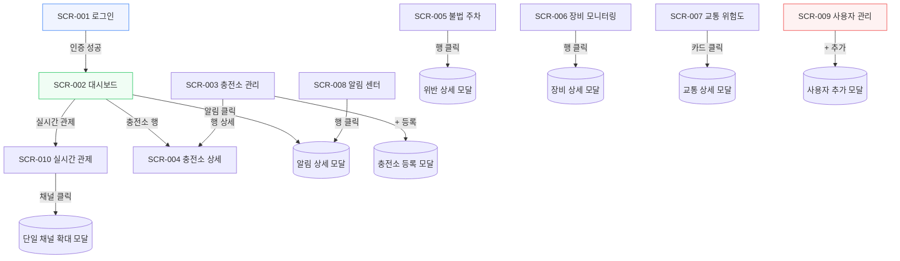

# 화면 설계서 (UI Design Specification)

> **E-pit AI 기반 스마트 충전소 통합 관제 시스템**

| 항목 | 내용 |
|------|------|
| 문서 버전 | v2.0 (전면 개정) |
| 작성일 | 2026-06-11 |
| 개정일 | 2026-06-11 |
| 작성자 | 수석 아키텍트 |
| 프론트엔드 | Vue.js 3 + TypeScript + Element Plus + ECharts + Pinia + Axios |
| 문서 상태 | 확정 (Baseline) |

---

## 0. 개정 개요 (v1.0 → v2.0)

본 개정은 UI 사용성 피드백 12건을 전면 반영한다. 핵심 변경 축은 다음과 같다.

1. **레이아웃 풀블리드(full-bleed)화** — 전 페이지 흰 여백 제거
2. **한글 인코딩 이슈 근절** — enum → 한글 label 변환 함수의 단일 출처(SSOT) 도입
3. **상세보기 모달의 전면 도입** — 대시보드/불법주차/PHM/교통/알림 모두 클릭 → ElDialog
4. **충전소 상세 페이지 강화** — 지도, 충전기 테이블, 파이차트, 위반/PHM/교통 카드
5. **CRUD 활성화** — 충전소 등록, 사용자 추가/삭제
6. **내보내기(Export)** — PDF / 이미지 / CSV(기간 필터)

### 0.1 변경사항 요약표

| # | 화면 | 변경 요구사항 | 핵심 구현 | 신규 의존성 |
|---|------|--------------|----------|------------|
| 0 | 전체 | 페이지 상하좌우 여백 제거 | `AppLayout` el-main `padding:0`, 뷰 내부 컨테이너가 100% 폭/높이 점유 | — |
| 1 | 충전소 관리 / 교통 위험도 | 한글 깨짐(???) 수정 | `utils/labels.ts` enum→한글 변환 SSOT, el-tag에 label 함수 적용 | — |
| 2 | 대시보드 | 최신 알림 → 상세 모달 | 알림 행 클릭 → `AlertDetailDialog` 공용 컴포넌트 | — |
| 3 | 충전소 상세 | 풍부한 상세 페이지 | Leaflet 지도, 충전기 테이블, 상태 파이차트, 위반/PHM/교통 카드 | leaflet |
| 4 | 충전소 관리 | 충전소 등록 버튼 활성화 | ADMIN 전용 `StationFormDialog` → `POST /api/v1/stations` | — |
| 5 | 불법 주차 | 행 클릭 상세 모달 | `ViolationDetailDialog` (이미지 2종 + placeholder) | — |
| 6 | 불법 주차 | 내보내기 (PDF/이미지/CSV) | jsPDF, html2canvas, CSV blob + 기간 필터 다이얼로그 | jspdf, html2canvas |
| 7 | 장비 모니터링 | 테이블 컬럼 간격 | el-table `min-width` 지정 + `width:100%` | — |
| 8 | 장비 모니터링 | 행 클릭 상세 모달 | `PhmDetailDialog` (센서값 + ECharts 게이지) | — |
| 9 | 교통 위험도 | 카드 클릭 상세 모달 | `TrafficDetailDialog` (기여 요인 표시) | — |
| 10 | 알림 센터 | 상세 모달 + 읽지않음 토글 | `AlertDetailDialog`, `PATCH /alerts/{id}/unread` (없으면 로컬 토글) | — |
| 11 | 사용자 관리 | 사용자 추가/삭제 | `MemberFormDialog`, `POST/DELETE /api/v1/members` (Backend API 신규) | — |
| 12 | **실시간 관제 (신규)** | CCTV 다중 채널 관제 화면 | `MonitorView.vue`, MP4(`<video>`) 그리드 + 전체화면/레이아웃/순환 툴바, 단일 채널 확대 모달 | — |

### 0.2 신규 npm 의존성

```bash
npm i leaflet jspdf html2canvas
npm i -D @types/leaflet
```

| 패키지 | 용도 | 사용 화면 |
|--------|------|----------|
| `leaflet` + OpenStreetMap 타일 | 무료/무키 지도 (Kakao 대안) | 충전소 상세 |
| `jspdf` | 테이블 → PDF 출력 | 불법 주차 내보내기 |
| `html2canvas` | DOM 영역 → 이미지 캡처 | 불법 주차 내보내기 |

> **지도 선택 근거**: Kakao Maps는 도메인 등록·JS 키 발급이 필요해 포트폴리오 데모 환경 재현성이 떨어진다. Leaflet + OpenStreetMap 타일은 키가 불필요하여 즉시 동작하므로 본 설계의 기본 채택안으로 한다. (Kakao 키 보유 시 동일 위치에 교체 가능)

---

## 1. 화면 구성 개요

### 1.1 화면 목록

| No | 화면 ID | 화면명 | 경로 | 접근 권한 | 컴포넌트 파일 |
|----|---------|--------|------|-----------|--------------|
| 1 | SCR-001 | 로그인 | `/login` | 비인증 | `views/LoginView.vue` |
| 2 | SCR-002 | 통합 대시보드 | `/dashboard` | VIEWER 이상 | `views/DashboardView.vue` |
| 3 | SCR-010 | 실시간 관제 (CCTV) | `/monitor` | VIEWER 이상 | `views/MonitorView.vue` |
| 4 | SCR-003 | 충전소 관리 | `/stations` | VIEWER 이상 | `views/StationListView.vue` |
| 5 | SCR-004 | 충전소 상세 | `/stations/:id` | VIEWER 이상 | `views/StationDetailView.vue` |
| 6 | SCR-005 | 불법 주차 | `/violations` | VIEWER 이상 | `views/ViolationListView.vue` |
| 7 | SCR-006 | 장비 모니터링 (PHM) | `/phm` | VIEWER 이상 | `views/PhmMonitorView.vue` |
| 8 | SCR-007 | 교통 위험도 | `/traffic` | VIEWER 이상 | `views/TrafficRiskView.vue` |
| 9 | SCR-008 | 알림 센터 | `/alerts` | VIEWER 이상 | `views/AlertCenterView.vue` |
| 10 | SCR-009 | 사용자 관리 | `/members` | **ADMIN 전용** | `views/MemberManageView.vue` |

### 1.2 공용 컴포넌트 (신규 디렉토리: `components/dialog/`)

| 컴포넌트 | 용도 | 사용 화면 |
|----------|------|----------|
| `AlertDetailDialog.vue` | 알림 상세 모달 (읽음/읽지않음 토글) | 대시보드, 알림 센터 |
| `ViolationDetailDialog.vue` | 위반 상세 모달 (이미지 2종) | 불법 주차 |
| `PhmDetailDialog.vue` | 장비 상세 모달 (센서 + 게이지) | 장비 모니터링 |
| `TrafficDetailDialog.vue` | 교통 위험도 상세 모달 | 교통 위험도 |
| `StationFormDialog.vue` | 충전소 등록/수정 폼 | 충전소 관리 |
| `MemberFormDialog.vue` | 사용자 추가 폼 | 사용자 관리 |
| `ExportRangeDialog.vue` | CSV 기간 필터 다이얼로그 | 불법 주차 |

### 1.3 화면 이동 흐름



---

## 2. [요구사항 0] 전역 레이아웃 — 여백 제거 (Full-bleed)

### 2.1 문제와 원인

기존 `AppLayout.vue`의 `el-main`은 Element Plus 기본 `padding: 20px`을 그대로 사용하고, 배경이 `#f0f2f5`로 깔려 각 뷰의 `el-card` 주변에 흰/회색 여백이 발생했다. 또한 각 뷰가 단일 `el-card`로만 감싸져 화면 폭을 100% 활용하지 못했다.

### 2.2 변경 규격

```
┌──────────────────────────────────────────────────────────────┐
│ HEADER (고정 64px)                      🔔3  ● 연결됨  admin   │
├──────────┬───────────────────────────────────────────────────┤
│          │                                                   │
│ SIDEBAR  │   MAIN (padding:0, 100%×100%, overflow:auto)      │
│ (220px)  │   ┌───────────────────────────────────────────┐   │
│          │   │  뷰 루트 컨테이너 (.page)                   │   │
│ 대시보드  │   │  width:100%; height:100%; box-sizing:border │   │
│ 충전소    │   │  내부 padding은 .page가 직접 16px 관리       │   │
│ 불법주차  │   │                                           │   │
│ 장비      │   └───────────────────────────────────────────┘   │
│ 교통      │                                                   │
│ 알림      │                                                   │
│ 사용자    │                                                   │
└──────────┴───────────────────────────────────────────────────┘
```

### 2.3 구현 지침

- `AppLayout.vue`의 `<el-main>`에 `style="padding:0; margin:0; background:#f0f2f5; overflow:auto"` 적용
- 전역 스타일(`App.vue` 또는 `assets/main.css`)에 reset 추가:

```css
html, body, #app { margin: 0; padding: 0; height: 100%; }
.el-main { --el-main-padding: 0; }
/* 모든 뷰의 루트 래퍼 공통 클래스 */
.page { width: 100%; min-height: 100%; box-sizing: border-box; padding: 16px; }
.page--flush { padding: 0; }  /* 지도 등 완전 풀블리드가 필요한 영역 */
```

- 각 뷰의 최상위 요소에 `class="page"` 부여 → 여백은 뷰가 16px 내부 패딩으로 일관 관리, 외곽 흰 여백은 제거
- 충전소 상세의 지도 카드는 `.page--flush`로 가장자리까지 채움

---

## 3. [요구사항 1] enum → 한글 label SSOT

### 3.1 문제

뷰마다 인라인 객체(`{ DETECTED:'감지', ... }[s]`)로 라벨을 중복 정의했고, 일부 enum(교통 위험도 `riskLevel`, 충전소 `operationStatus`)은 한글 매핑이 누락되어 원문 enum이 그대로 노출되거나 `???`로 표시됐다.

### 3.2 해결 — `utils/labels.ts` 단일 출처

전 계층 SSOT(DB CHECK / JPA / TS / pydantic) 원칙에 맞춰, 프론트의 표시 라벨도 한 파일에 모은다.

```typescript
// frontend/src/utils/labels.ts

export const operationStatusLabel: Record<string, string> = {
  ACTIVE: '운영중', MAINTENANCE: '점검중', CLOSED: '폐쇄',
}
export const chargerStatusLabel: Record<string, string> = {
  AVAILABLE: '대기', CHARGING: '충전중', FAULT: '고장', OFFLINE: '오프라인', RESERVED: '예약',
}
export const connectorTypeLabel: Record<string, string> = {
  CCS1: 'DC콤보1', CCS2: 'DC콤보2', CHADEMO: '차데모', AC3: 'AC 3상',
}
export const violationTypeLabel: Record<string, string> = {
  NON_EV_OCCUPANCY: '비전기차 점유', OVERSTAY: '장시간 점유',
}
export const violationStatusLabel: Record<string, string> = {
  DETECTED: '감지', NOTIFIED: '통보됨', RESOLVED: '해결', FALSE_POSITIVE: '오감지',
}
export const phmRiskLabel: Record<string, string> = {
  NORMAL: '정상', WARNING: '경고', CRITICAL: '위험',
}
export const trafficRiskLabel: Record<string, string> = {
  LOW: '낮음', MEDIUM: '보통', HIGH: '높음', CRITICAL: '심각',
}
export const alertTypeLabel: Record<string, string> = {
  PARKING_VIOLATION: '불법 주차', EQUIPMENT_FAILURE: '장비 고장',
  TRAFFIC_RISK: '교통 위험', SYSTEM: '시스템',
}
export const alertSeverityLabel: Record<string, string> = {
  INFO: '정보', WARNING: '경고', CRITICAL: '심각',
}
export const memberRoleLabel: Record<string, string> = {
  ADMIN: '관리자', OPERATOR: '운영자', VIEWER: '조회자',
}

/** 안전 변환: 매핑이 없으면 원문 반환 (?? 깨짐 방지) */
export function label(map: Record<string, string>, key: string | null | undefined): string {
  if (!key) return '-'
  return map[key] ?? key
}
```

### 3.3 적용

- **충전소 관리/상세**: `label(operationStatusLabel, row.operationStatus)`, `label(chargerStatusLabel, row.status)`, `label(connectorTypeLabel, row.connectorType)`
- **교통 위험도**: `label(trafficRiskLabel, risk.riskLevel)` — el-tag 텍스트로 한글 표기
- 인코딩 보강: `index.html` `<meta charset="UTF-8">` 확인, Vite/소스 파일 UTF-8 저장 일관 유지

---

## 4. 화면 상세 설계

### 4.1 SCR-001 로그인 (변경 없음)

**목적**: 사용자 인증 및 JWT 발급. **URL**: `/login`.

기존 v1.0 설계 유지(센터 정렬 카드, `POST /api/v1/auth/login`). 단, 배경 풀블리드(`height:100vh; margin:0`) 적용.

---

### 4.2 SCR-002 통합 대시보드

**목적**: 전체 현황 모니터링 + 최신 알림 상세 모달. **URL**: `/dashboard`.

#### 레이아웃

```
┌───────────────────────────────────────────────────────────────┐
│ ■ KPI 카드 (4개, 폭 100% 균등)                                  │
│ ┌─────────┐ ┌─────────┐ ┌─────────┐ ┌─────────┐               │
│ │전체충전소│ │오늘위반 │ │위험장비 │ │미읽음알림│               │
│ │   5     │ │   2     │ │   1     │ │   3     │               │
│ └─────────┘ └─────────┘ └─────────┘ └─────────┘               │
├─────────────────────────────────┬─────────────────────────────┤
│ ■ 충전소 현황 테이블 (span 14)   │ ■ 최신 알림 (span 10)        │
│ 코드/충전소명/상태/충전기수      │ ┌─────────────────────────┐ │
│ (행 클릭 → 충전소 상세 이동)     │ │ [경고] 비전기차 점유  3분전│◀┐│
│                                 │ │ [심각] CH-003 고장   5분전 ││││
│                                 │ │ [경고] 교통위험 HIGH  9분전 ││││
│                                 │ └─────────────────────────┘ │││
│                                 │  행 클릭 → AlertDetailDialog─┘││
└─────────────────────────────────┴─────────────────────────────┘
```

#### [요구사항 2] 최신 알림 상세 모달

- 각 알림 행 클릭 → `AlertDetailDialog` 오픈(공용 컴포넌트, §4.8과 동일)
- 모달 표시 항목: **알림 유형 / 중요도 / 제목 / 메시지 전문 / 충전소·충전기 참조 / 발생 시각**
- 모달 오픈과 동시에 미읽음이면 `markRead(id)` 자동 호출(읽음 처리)

#### 컴포넌트 구성

| 컴포넌트 | 설명 |
|---------|------|
| KPI `el-card` ×4 | overview 값 바인딩, 0 기준 색상 전환 |
| 충전소 `el-table` | `@row-click` → `/stations/:id` |
| 알림 리스트 | `@click` → `selectedAlert` 설정 후 모달 오픈 |
| `AlertDetailDialog` | 공용 모달 (`v-model:visible`, `:alert`) |

#### API 연동

| 동작 | 엔드포인트 |
|------|-----------|
| 요약 | `GET /api/v1/dashboard/overview` |
| 충전소 목록 | `GET /api/v1/stations` |
| 최신 알림 | `GET /api/v1/alerts?size=8` |
| 읽음 처리 | `PATCH /api/v1/alerts/{id}/read` |

---

### 4.2a SCR-010 실시간 관제 (CCTV) — 신규

**목적**: 충전소별 CCTV 채널을 그리드로 동시 모니터링하는 관제 센터 화면. **URL**: `/monitor`.

> 포트폴리오 데모 환경이므로 실제 RTSP/CCTV 대신 로컬 MP4(`/public/videos/parking.mp4`)를 `<video>` 태그로 재생한다. 향후 WebSocket 기반 HLS 스트림으로 무중단 대체할 수 있도록 video `src`를 store 변수로 관리한다.

#### 레이아웃 (관제 센터 다크 테마 · 풀블리드)

```
┌───────────────────────────────────────────────────────────────┐  배경 #1a1a2e
│ ■ 툴바  [⛶ 전체화면] [1×1│2×2│2×3 ▼] [⟳ 자동순환 OFF]  4 채널 │
├───────────────────────────────────────────────────────────────┤
│ ┌──────────────────┐ ┌──────────────────┐ ┌────────────────┐  │
│ │●REC  12:28:41    │ │●REC  12:28:41    │ │●REC  12:28:41 │  │
│ │ cam-gn-001       │ │ cam-sc-001       │ │ cam-pg-001    │  │
│ │ [   video MP4   ]│ │ [   video MP4   ]│ │ [  video MP4 ]│  │
│ │ 현대 강남 E-pit   │ │ 서초 E-pit       │ │ 판교 충전소    │  │
│ │            ●정상 │ │            ●정상 │ │       ○오프라인│  │
│ └──────────────────┘ └──────────────────┘ └────────────────┘  │
│ ┌──────────────────┐ ┌──────────────────┐ ┌────────────────┐  │
│ │ ... (2행 × 3열 그리드, 충전소 수만큼 채널 카드 반복)        │  │
│ └──────────────────┘ └──────────────────┘ └────────────────┘  │
└───────────────────────────────────────────────────────────────┘
   카드 클릭 → 단일 채널 전체 확대 모달(ElDialog fullscreen)
```

#### 채널 카드 구성 (`ChannelCard`)

| 요소 | 설명 |
|------|------|
| `<video>` | `muted autoplay loop playsinline`, `:src="store.videoSrc"`, `object-fit:cover` |
| REC 뱃지 | 좌상단 빨간 `● REC` (깜빡임 애니메이션), 실시간 느낌 연출 |
| 시각 오버레이 | 우상단 현재 시각 `HH:mm:ss` (1초 간격 갱신, dayjs) |
| 카메라 ID | 상단 라벨 (`station.cameraDeviceId`, 없으면 `cam-{code}`) |
| 충전소명 | 하단 라벨 (`station.name`) |
| 상태 뱃지 | `● 정상`(초록) / `○ 오프라인`(회색) — `operationStatus` 기준 |

#### 상단 툴바 기능

| 컨트롤 | 동작 |
|--------|------|
| 전체화면 토글 | `document.documentElement.requestFullscreen()` / `exitFullscreen()` |
| 그리드 레이아웃 전환 | `el-segmented` 또는 `el-radio-group`: `1×1` / `2×2` / `2×3` — CSS Grid `grid-template-columns` 동적 변경 |
| 자동 순환(Carousel) 토글 | ON 시 `1×1` 모드로 N초(기본 5초)마다 채널 자동 전환(`setInterval`), OFF 시 그리드 복귀 |

#### [신규] 단일 채널 확대 모달

- 트리거: 채널 카드 `@click` → `selectedChannel` 설정, 모달 오픈
- `el-dialog` `fullscreen`(또는 전체 너비) — 단일 채널을 크게 재생, REC·시각·충전소명 오버레이 유지
- 닫기 시 그리드 복귀

#### 컴포넌트 구성

| 영역 | 컴포넌트 | 설명 |
|------|---------|------|
| 루트 | `.page .page--flush .monitor-dark` | 여백 0, 다크 배경(#1a1a2e) |
| 툴바 | `el-button` + `el-segmented` | 전체화면/레이아웃/순환 |
| 그리드 | CSS Grid | `gridCols` 반응형 `grid-template-columns` |
| 채널 | `ChannelCard` ×N | video + 오버레이 + 상태 뱃지 |
| 확대 | `el-dialog` fullscreen | 단일 채널 확대 재생 |

#### 상태 관리 (`stores/monitor.ts` 신규 — 개념)

```typescript
interface MonitorStore {
  channels: { cameraId: string; stationName: string; online: boolean }[]
  videoSrc: string        // 기본 '/videos/parking.mp4', 추후 HLS URL로 교체
  layout: '1x1' | '2x2' | '2x3'
  carousel: boolean
}
```

> 충전소 목록(`GET /api/v1/stations`)으로 채널 메타데이터(카메라ID·충전소명·상태)를 구성한다. 영상 소스 자체는 단일 MP4를 공유하되, 장기적으로는 채널별 HLS 스트림 URL을 `videoSrc` 대신 채널 객체에 둘 수 있도록 확장 가능하게 설계한다.

#### API 연동

| 동작 | 엔드포인트 | 비고 |
|------|-----------|------|
| 채널 목록(충전소) | `GET /api/v1/stations` | 채널명·상태 구성용 |
| 영상 스트림 | — (정적 파일) | `/public/videos/parking.mp4`, 별도 API 없음 |

> 영상 전용 신규 API는 없다. 장기적으로 WebSocket HLS 스트림으로 대체 시 `videoSrc`만 교체한다.

#### 사이드바 메뉴

- 네비게이션 순서: 대시보드 → **실시간 관제** → 충전소 관리 → … (대시보드 직후 배치)
- 아이콘: `VideoCamera` (Element Plus 아이콘)
- 라벨: `실시간 관제`
- 라우트: `/monitor` → `MonitorView.vue` (VIEWER 이상)

---

### 4.3 SCR-003 충전소 관리

**목적**: 충전소 목록 + ADMIN 신규 등록. **URL**: `/stations`.

#### 레이아웃

```
┌───────────────────────────────────────────────────────────────┐
│  충전소 목록                                  [+ 충전소 등록]    │  ← ADMIN만
├───────────────────────────────────────────────────────────────┤
│ ┌──────┬─────────┬──────────────┬──────┬──────┬─────────────┐  │
│ │코드  │충전소명 │주소          │상태  │충전기│관리         │  │
│ ├──────┼─────────┼──────────────┼──────┼──────┼─────────────┤  │
│ │GN-001│현대강남 │강남구 테헤란…│운영중│ 4   │[상세]       │  │
│ │SC-001│서초E-pit│서초구 …      │점검중│ 8   │[상세]       │  │
│ └──────┴─────────┴──────────────┴──────┴──────┴─────────────┘  │
│ < 1 2 3 >  (총 5개)                                            │
└───────────────────────────────────────────────────────────────┘
```

> 상태 컬럼은 `label(operationStatusLabel, ...)`로 **운영중/점검중/폐쇄** 한글 표기 (요구사항 1 적용)

#### [요구사항 4] 충전소 등록 모달 (`StationFormDialog`)

```
┌─────────────────────────────────┐
│  충전소 등록                     │
├─────────────────────────────────┤
│  충전소 코드*  [EPIT-GN-002   ]  │
│  이름*         [현대 강남2     ]  │
│  주소*         [서울 강남구 …  ]  │
│  위도*         [37.4979       ]  │
│  경도*         [127.0276      ]  │
│  운영 상태*    [운영중      ▼ ]  │
│  카메라 ID     [cam-gn-002    ]  │
├─────────────────────────────────┤
│              [취소]  [등록]      │
└─────────────────────────────────┘
```

- 트리거: `authStore.hasRole('ADMIN')`일 때만 버튼 활성 → 클릭 시 `dialogVisible=true`
- `el-form` 유효성: 코드/이름/주소/위도/경도/상태 필수, 위도(-90~90)·경도(-180~180) 범위 룰
- 제출: `POST /api/v1/stations` → 성공 시 `ElMessage.success`, 목록 재조회, 모달 닫기

#### API 연동

| 동작 | 엔드포인트 | 권한 |
|------|-----------|------|
| 목록 | `GET /api/v1/stations` | VIEWER+ |
| 등록 | `POST /api/v1/stations` | ADMIN |

요청 바디:
```json
{ "stationCode":"EPIT-GN-002", "name":"현대 강남2", "address":"서울 강남구 …",
  "latitude":37.4979, "longitude":127.0276, "operationStatus":"ACTIVE", "cameraDeviceId":"cam-gn-002" }
```

---

### 4.4 SCR-004 충전소 상세 (전면 강화)

**목적**: 단일 충전소의 지도·충전기·위반·PHM·교통을 한 화면에 집약. **URL**: `/stations/:id`.

#### [요구사항 3] 풍부한 레이아웃 (빈 여백 없이 꽉 참)

```
┌───────────────────────────────────────────────────────────────┐
│ ← 충전소 목록 | 현대 강남 E-pit (EPIT-GN-001)        운영중      │
├───────────────────────────┬───────────────────────────────────┤
│ ■ 충전소 정보 (span 8)     │ ■ 위치 지도 (span 16)             │
│ 코드 / 주소 / 카메라ID     │ ┌───────────────────────────────┐ │
│ 위도·경도 / 등록일         │ │  Leaflet + OSM, 위/경도 핀     │ │
│                           │ │  (.page--flush 풀블리드)       │ │
├───────────────────────────┤ └───────────────────────────────┘ │
│ ■ 충전기 상태 분포(파이)   │                                   │
│  ECharts 도넛              │                                   │
│  대기/충전중/고장/오프라인  │                                   │
├───────────────────────────┴───────────────────────────────────┤
│ ■ 충전기 목록                                                  │
│ ┌──────┬────────┬──────┬──────┬────────────────────────────┐  │
│ │코드  │커넥터  │최대kW│상태  │건강도(progress bar)        │  │
│ ├──────┼────────┼──────┼──────┼────────────────────────────┤  │
│ │CH01  │DC콤보2 │ 350  │대기  │ ████████░░ 95.2 정상       │  │
│ │CH03  │DC콤보1 │ 100  │고장  │ ████░░░░░░ 45.0 위험       │  │
│ └──────┴────────┴──────┴──────┴────────────────────────────┘  │
├───────────────────┬───────────────────┬───────────────────────┤
│ ■ 최근 위반 (5건) │ ■ 최근 PHM 예측   │ ■ 교통 위험도          │
│ 시각/번호판/유형  │ 충전기/위험/잔여  │ 위험수준 / 점수        │
│                   │                   │ 혼잡도 / 날씨          │
└───────────────────┴───────────────────┴───────────────────────┘
```

#### 컴포넌트 구성

| 영역 | 컴포넌트 | 설명 |
|------|---------|------|
| 헤더 | `el-page-header` | 뒤로가기 + 충전소명 + 상태 태그(한글) |
| 정보 | `el-descriptions` | 코드/주소/위경도/카메라/등록일 |
| 지도 | Leaflet `L.map` | OSM 타일, `L.marker([lat,lng])` 핀 + 팝업(충전소명) |
| 파이 | ECharts pie/doughnut | 충전기 상태 집계(대기/충전중/고장/오프라인) |
| 충전기 | `el-table` | 코드/커넥터(한글)/kW/상태(한글)/건강도 `el-progress` |
| 위반 | `el-table` size=small | 최근 5건, 행 클릭 → 위반 상세 모달 재사용 |
| PHM | `el-table` size=small | 최근 예측, 행 클릭 → PHM 상세 모달 재사용 |
| 교통 | `el-card` | 최신 위험도 카드, 클릭 → 교통 상세 모달 재사용 |

#### 건강도(healthScore) 시각화 규칙

| 점수 | 색상 | 뱃지 |
|------|------|------|
| 0–40 | 빨강 (#f5222d) | 위험 |
| 41–70 | 주황 (#fa8c16) | 경고 |
| 71–100 | 초록 (#52c41a) | 정상 |

#### Leaflet 초기화 패턴

```typescript
import L from 'leaflet'
import 'leaflet/dist/leaflet.css'

const map = L.map(mapEl.value).setView([station.latitude, station.longitude], 16)
L.tileLayer('https://{s}.tile.openstreetmap.org/{z}/{x}/{y}.png', {
  attribution: '© OpenStreetMap', maxZoom: 19,
}).addTo(map)
L.marker([station.latitude, station.longitude]).addTo(map)
  .bindPopup(station.name).openPopup()
```

> `onMounted`에서 DOM 준비 후 초기화, `onBeforeUnmount`에서 `map.remove()` 호출(메모리 누수 방지).

#### API 연동

| 영역 | 엔드포인트 |
|------|-----------|
| 충전소 단건 | `GET /api/v1/stations/{id}` |
| 요약(집계) | `GET /api/v1/stations/{id}/summary` |
| 충전기 목록 | `GET /api/v1/stations/{id}/chargers` |
| 최근 위반 | `GET /api/v1/stations/{id}/violations?size=5` |
| 최근 PHM | `GET /api/v1/stations/{id}/predictions?size=5` |
| 최신 교통 위험 | `GET /api/v1/stations/{id}/risk/latest` |

---

### 4.5 SCR-005 불법 주차

**목적**: 위반 이력 조회 + 상세 모달 + 내보내기. **URL**: `/violations`.

#### 레이아웃

```
┌───────────────────────────────────────────────────────────────┐
│  불법 주차 위반 현황    [PDF 내보내기][이미지 내보내기][CSV 내보내기]│
├───────────────────────────────────────────────────────────────┤
│  검색: [충전소 ▼] [상태 ▼] [조회]    오늘 2 | 주 8 | 미처리 3   │
├───────────────────────────────────────────────────────────────┤
│ ┌────────┬────────┬────────┬──────────────┬──────────┐         │
│ │감지시각│충전소  │번호판  │위반유형      │처리상태  │  ← 행 클릭│
│ ├────────┼────────┼────────┼──────────────┼──────────┤  → 모달  │
│ │06/11   │현대강남│99나8765│비전기차 점유 │감지      │         │
│ │02:15   │서초    │33가1234│비전기차 점유 │해결      │         │
│ └────────┴────────┴────────┴──────────────┴──────────┘         │
└───────────────────────────────────────────────────────────────┘
```

#### [요구사항 5] 위반 상세 모달 (`ViolationDetailDialog`)

```
┌───────────────────────────────────────────────┐
│  위반 상세 정보                                 │
├───────────────────────────────────────────────┤
│  감지 시각   : 2026-06-11 12:28:41 KST         │
│  충전소명    : 현대 강남 E-pit                  │
│  충전소 내 위치: 3번 구역                       │
│  위반 유형   : 비전기차 점유                    │
│  번호판      : 99나8765                         │
│  처리 상태   : [감지] 태그                      │
│  사유        : 비전기차가 급속 충전구역 점유     │
├───────────────────────────────────────────────┤
│  차량 전체 이미지            번호판 크롭          │
│  ┌──────────────────┐      ┌───────────────┐   │
│  │   vehicle.jpg     │      │ plate-crop.jpg │   │
│  │  (없으면 회색      │      │ (없으면 회색   │   │
│  │   placeholder)    │      │  placeholder)  │   │
│  └──────────────────┘      └───────────────┘   │
├───────────────────────────────────────────────┤
│                              [닫기]            │
└───────────────────────────────────────────────┘
```

- 트리거: `el-table @row-click` → `selectedViolation` 설정, 모달 오픈
- 이미지: `row.evidenceImagePath` 존재 시 표시, 없으면 `el-empty` 또는 회색 placeholder 박스
- 충전소 내 위치/사유는 응답 필드(`slotNumber`, `reason`) 사용, 없으면 `-`

#### [요구사항 6] 내보내기 기능

**상단 버튼 그룹** (`el-button-group`): `PDF 내보내기` / `이미지 내보내기` / `CSV 내보내기`

| 버튼 | 라이브러리 | 동작 |
|------|-----------|------|
| PDF | `jspdf` | 테이블 데이터를 jsPDF에 행 단위 출력 후 `violations_YYYYMMDD.pdf` 저장 |
| 이미지 | `html2canvas` | 테이블 영역 DOM 캡처 → PNG dataURL → 다운로드 |
| CSV | (내장) | `ExportRangeDialog`로 기간 선택 → 해당 기간 데이터만 CSV blob 생성·다운로드 |

**CSV 기간 필터 다이얼로그 (`ExportRangeDialog`)**

```
┌─────────────────────────────────┐
│  CSV 내보내기 — 기간 선택        │
├─────────────────────────────────┤
│  기간*  [2026-06-01] ~ [2026-06-11]│  ← el-date-picker type=daterange
├─────────────────────────────────┤
│              [취소]  [내보내기]   │
└─────────────────────────────────┘
```

CSV 생성 로직(개념):
```typescript
const filtered = violations.filter(v =>
  dayjs(v.occurredAt).isBetween(start, end, 'day', '[]'))
const header = ['감지시각','충전소','번호판','위반유형','처리상태']
const rows = filtered.map(v => [
  formatTime(v.occurredAt), v.stationName, v.plateNumber,
  label(violationTypeLabel, v.violationType), label(violationStatusLabel, v.status),
])
const csv = '' + [header, ...rows].map(r => r.join(',')).join('\n') // BOM=한글깨짐방지
downloadBlob(new Blob([csv], { type: 'text/csv' }), `violations_${range}.csv`)
```

> CSV 앞에 ``(BOM)을 붙여 Excel에서 한글이 깨지지 않도록 한다 (요구사항 1과 동일 맥락).

#### API 연동

| 동작 | 엔드포인트 |
|------|-----------|
| 목록 | `GET /api/v1/violations?size=50` |
| (옵션) 충전소 필터 | `GET /api/v1/violations?stationId={id}&status={s}` |

---

### 4.6 SCR-006 장비 모니터링 (PHM)

**목적**: 예지보전 예측 목록 + 컬럼 정렬 개선 + 상세 모달. **URL**: `/phm`.

#### [요구사항 7] 테이블 컬럼 간격 수정

기존: 일부 컬럼만 `width` 지정 → 마지막 유동 컬럼이 우측으로 늘어나며 데이터가 좌측에 몰림. 
변경: 테이블 `style="width:100%"`, 각 컬럼에 `min-width` 지정하여 폭을 비례 분배.

```
┌───────────────────────────────────────────────────────────────┐
│  장비 상태 모니터링 (PHM)                                       │
├──────────────┬──────────┬─────────┬───────────┬───────────────┤
│ 예측 시각    │ 충전기   │ 위험등급│ 고장 확률 │ 잔여수명/부품 │  ← min-width
│ (min 160)    │ (min 120)│(min 110)│ (min 160) │  (flex)       │
├──────────────┼──────────┼─────────┼───────────┼───────────────┤
│ 06/11 03:25  │ CH-003   │ 위험    │ ███ 70%   │ 48h cooling_fan│ ← 행 클릭
└──────────────┴──────────┴─────────┴───────────┴───────────────┘
```

#### [요구사항 8] 장비 상세 모달 (`PhmDetailDialog`)

```
┌───────────────────────────────────────────────┐
│  장비 상세 — CH-003                            │
├──────────────────────────┬────────────────────┤
│  충전기 정보             │  ECharts 게이지     │
│  코드 / 충전소           │  ┌──────────────┐   │
│  위험 등급 : 위험         │  │  고장 확률    │   │
│  고장 확률 : 70.2%        │  │   ◔ 70.2%    │   │
│  잔여 수명 : 48시간       │  └──────────────┘   │
│  예상 부품 : cooling_fan  │  (구간색: 녹/황/적)  │
├──────────────────────────┴────────────────────┤
│  최근 센서값                                    │
│  전압 402V | 전류 118A | 온도 67℃ | 진동 0.42  │
├───────────────────────────────────────────────┤
│                              [닫기]            │
└───────────────────────────────────────────────┘
```

- 트리거: 행 클릭 → `selectedPrediction` 설정, 모달 오픈
- 게이지: ECharts `gauge` 타입, `failureProbability*100`을 값으로, 0–50 녹색 / 50–80 황색 / 80–100 적색 구간
- 최근 센서값: `GET /api/v1/chargers/{id}/health/latest` (전압/전류/온도/진동)
- 위험 등급/부품 등 모든 enum 텍스트는 `label(phmRiskLabel, ...)` 한글 표기

#### API 연동

| 동작 | 엔드포인트 |
|------|-----------|
| 위험 예측 목록 | `GET /api/v1/predictions/critical` |
| 최근 센서값 | `GET /api/v1/chargers/{id}/health/latest` |

---

### 4.7 SCR-007 교통 위험도

**목적**: 충전소별 교통 위험도 카드 + 상세 모달. **URL**: `/traffic`.

#### 레이아웃 (한글 라벨 적용)

```
┌───────────────────────────────────────────────────────────────┐
│  교통 위험도 분석                                               │
├───────────────────────────────────────────────────────────────┤
│ ┌─────────────┐ ┌─────────────┐ ┌─────────────┐               │
│ │현대 강남     │ │서초 E-pit    │ │판교 충전소   │   ← 카드 클릭 │
│ │[낮음]        │ │[보통]        │ │[높음]        │   → 모달     │
│ │위험도 23.0%  │ │위험도 55.0%  │ │위험도 78.0%  │               │
│ └─────────────┘ └─────────────┘ └─────────────┘               │
└───────────────────────────────────────────────────────────────┘
```

> 태그 텍스트는 `label(trafficRiskLabel, riskLevel)` → **낮음/보통/높음/심각** (요구사항 1 핵심 — 기존 `???` 해소)

#### [요구사항 9] 교통 상세 모달 (`TrafficDetailDialog`)

```
┌───────────────────────────────────────────────┐
│  교통 위험도 상세 — 현대 강남 E-pit            │
├───────────────────────────────────────────────┤
│  충전소명  : 현대 강남 E-pit                    │
│  위험 수준 : [보통] 태그                        │
│  위험도 점수: 0.55 (55.0%)                      │
│  분석 시각 : 2026-06-11 03:28:00 KST           │
├───────────────────────────────────────────────┤
│  기여 요인 (contributingFactors)               │
│  ┌─────────────────────┬──────────────────┐   │
│  │ 혼잡도              │ ████████ 0.42     │   │
│  │ 평균속도            │ ████ 0.21         │   │
│  │ 노면상태            │ ██ 0.12           │   │
│  └─────────────────────┴──────────────────┘   │
├───────────────────────────────────────────────┤
│                              [닫기]            │
└───────────────────────────────────────────────┘
```

- 트리거: 카드 `@click` → `selectedRisk` 설정, 모달 오픈
- 기여 요인: `contributingFactors`(Record<string,number>) 키별로 `el-progress` 또는 미니 바 차트, 값 큰 순 정렬
- 위험 수준 태그 색상: 낮음=success / 보통=warning / 높음=danger / 심각=danger(굵게)

#### 위험도 색상 기준

| 위험도 | 한글 | 색상 |
|--------|------|------|
| LOW | 낮음 | 초록 #22c55e |
| MEDIUM | 보통 | 노랑 #eab308 |
| HIGH | 높음 | 주황 #f97316 |
| CRITICAL | 심각 | 빨강 #ef4444 |

#### API 연동

| 동작 | 엔드포인트 |
|------|-----------|
| 충전소 목록 | `GET /api/v1/stations` |
| 충전소별 최신 위험도 | `GET /api/v1/stations/{id}/risk/latest` |

---

### 4.8 SCR-008 알림 센터

**목적**: 알림 이력 + 상세 모달 + 읽음/읽지않음 토글. **URL**: `/alerts`.

#### 레이아웃

```
┌───────────────────────────────────────────────────────────────┐
│  알림 센터  (미읽음 3)                       [모두 읽음 처리]    │
├───────────────────────────────────────────────────────────────┤
│ ┌──────┬────────────┬────────┬──────────────┬────────┬──────┐ │
│ │중요도│유형        │충전소  │제목          │시각    │읽음  │ │ ← 행 클릭
│ ├──────┼────────────┼────────┼──────────────┼────────┼──────┤ │ → 모달
│ │ ●심각│장비 고장   │현대강남│CH-003 고장…  │03:25   │[읽음]│ │
│ │ ●경고│불법 주차   │현대강남│비전기차 점유 │03:28   │[읽음]│ │
│ │ 정보 │시스템      │-       │점검 완료     │02:00   │ ✓    │ │
│ └──────┴────────────┴────────┴──────────────┴────────┴──────┘ │
└───────────────────────────────────────────────────────────────┘
```

#### [요구사항 10] 알림 상세 모달 + 읽지않음 되돌리기 (`AlertDetailDialog` — 공용)

```
┌───────────────────────────────────────────────┐
│  알림 상세                                      │
├───────────────────────────────────────────────┤
│  유형     : 장비 고장                           │
│  중요도   : [심각] 태그                         │
│  제목     : 충전기 CH-003 고장 예측             │
│  메시지   : 고장 확률 70.2%, 잔여 수명 48시간.  │
│            냉각팬(cooling_fan) 점검 필요.        │
│  참조     : CHARGER #3 (현대 강남 E-pit)        │
│  발생 시각 : 2026-06-11 03:25:10 KST            │
├───────────────────────────────────────────────┤
│         [읽지 않음으로 표시]        [닫기]      │
└───────────────────────────────────────────────┘
```

- **공용 컴포넌트**: 대시보드(§4.2)와 알림 센터가 동일 `AlertDetailDialog` 사용
- 모달 오픈 시 미읽음이면 자동 읽음 처리(`PATCH /alerts/{id}/read`)
- **읽지않음 토글**: 모달 하단 `[읽지 않음으로 표시]` 버튼
  - 1차: `PATCH /api/v1/alerts/{id}/unread` 호출 시도
  - **Backend에 unread API가 없을 경우**: 프론트 store에서 해당 알림의 `isRead=false`로 **로컬 상태만 토글**하고 `unreadCount`를 1 증가 (낙관적 처리). 본 설계의 기본 폴백.

```typescript
async function markUnread(id: number) {
  try {
    await alertApi.markUnread(id)         // PATCH /alerts/{id}/unread (있으면)
  } catch {
    /* 폴백: 로컬 토글만 */
  }
  const a = alerts.value.find(x => x.id === id)
  if (a && a.isRead) { a.isRead = false; unreadCount.value++ }
}
```

> `alertApi`에 `markUnread: (id) => http.patch('/alerts/'+id+'/unread')` 추가 필요.

#### 알림 유형/심각도 표시

| 유형 | 한글 | 아이콘 | 색상 |
|------|------|--------|------|
| PARKING_VIOLATION | 불법 주차 | 🚗 | 주황 |
| EQUIPMENT_FAILURE | 장비 고장 | ⚡ | 빨강 |
| TRAFFIC_RISK | 교통 위험 | 🚦 | 노랑 |
| SYSTEM | 시스템 | ⚙️ | 파랑 |

| 심각도 | 한글 | 뱃지 |
|--------|------|------|
| INFO | 정보 | 파랑 |
| WARNING | 경고 | 주황 |
| CRITICAL | 심각 | 빨강(굵게) |

#### API 연동

| 동작 | 엔드포인트 |
|------|-----------|
| 목록 | `GET /api/v1/alerts` |
| 미읽음 수 | `GET /api/v1/alerts/unread-count` |
| 읽음 | `PATCH /api/v1/alerts/{id}/read` |
| 읽지 않음 | `PATCH /api/v1/alerts/{id}/unread` *(없으면 로컬 폴백)* |
| 전체 읽음 | `PATCH /api/v1/alerts/read-all` |

---

### 4.9 SCR-009 사용자 관리 (ADMIN 전용)

**목적**: 사용자 목록 + 추가/삭제. **URL**: `/members`. **권한**: ADMIN.

#### 레이아웃

```
┌───────────────────────────────────────────────────────────────┐
│  사용자 관리                                   [+ 사용자 추가]   │
├───────────────────────────────────────────────────────────────┤
│ ┌────────┬────────┬──────────────────┬────────┬──────┬───────┐ │
│ │아이디  │이름    │이메일            │역할    │상태  │관리   │ │
│ ├────────┼────────┼──────────────────┼────────┼──────┼───────┤ │
│ │admin   │관리자  │admin@epit.com    │관리자  │활성  │[삭제] │ │
│ │op01    │김운영  │op01@epit.com     │운영자  │활성  │[삭제] │ │
│ └────────┴────────┴──────────────────┴────────┴──────┴───────┘ │
└───────────────────────────────────────────────────────────────┘
```

> 역할 컬럼은 `label(memberRoleLabel, ...)` → 관리자/운영자/조회자 한글 표기

#### [요구사항 11] 사용자 추가 모달 (`MemberFormDialog`)

```
┌─────────────────────────────────┐
│  사용자 추가                     │
├─────────────────────────────────┤
│  아이디*    [op02            ]   │
│  이름*      [이운영          ]   │
│  이메일*    [op02@epit.com   ]   │
│  역할*      [운영자        ▼ ]   │  ADMIN/OPERATOR/VIEWER
│  비밀번호*  [••••••••        ]   │
├─────────────────────────────────┤
│              [취소]  [추가]      │
└─────────────────────────────────┘
```

- 추가: `el-form` 유효성(아이디·이름 필수, 이메일 형식, 비밀번호 최소 8자) → `POST /api/v1/members`
- 삭제: 각 행 `[삭제]` → `ElMessageBox.confirm('정말 삭제하시겠습니까?')` → `DELETE /api/v1/members/{id}` → 목록 재조회
- 본인(현재 로그인 ADMIN) 행은 삭제 버튼 비활성(자기 삭제 방지)

#### Backend 신규 REST API (Spring Boot — 추가 필요)

`com.epit.admin.member.MemberController`

| 메서드 | 경로 | 권한 | 요청/응답 |
|--------|------|------|----------|
| GET | `/api/v1/members` | ADMIN | `Page<MemberResponse>` |
| POST | `/api/v1/members` | ADMIN | `MemberCreateRequest` → `MemberResponse` |
| DELETE | `/api/v1/members/{id}` | ADMIN | 204 No Content |

`MemberCreateRequest`:
```json
{ "username":"op02", "name":"이운영", "email":"op02@epit.com",
  "role":"OPERATOR", "password":"changeme8" }
```

구현 메모(프로젝트 컨벤션 준수):
- 비밀번호는 `PasswordEncoder`로 해시 저장
- 응답 래퍼 `ApiResponse<T>` 사용, 예외는 `BusinessException(ErrorCode)`
- 컨트롤러 보안: `@PreAuthorize("hasRole('ADMIN')")` (static `MethodSecurityExpressionHandler` 빈 전제 — 세션3 결정사항)
- 중복 username/email 시 `ErrorCode.DUPLICATE_MEMBER` 등 비즈니스 예외

#### API 연동 (Frontend `member.api.ts` 신규)

```typescript
export const memberApi = {
  list:   ()              => http.get('/members'),
  create: (data) => http.post('/members', data),
  remove: (id: number)    => http.delete(`/members/${id}`),
}
```

---

## 5. 공용 모달 컴포넌트 명세 요약

| 컴포넌트 | Props | Emits | 핵심 동작 |
|----------|-------|-------|----------|
| `AlertDetailDialog` | `visible`, `alert: AlertResponse` | `update:visible`, `unread` | 오픈 시 자동 읽음, 읽지않음 토글 |
| `ViolationDetailDialog` | `visible`, `violation: ViolationResponse` | `update:visible` | 이미지 2종 + placeholder |
| `PhmDetailDialog` | `visible`, `prediction`, `health` | `update:visible` | ECharts 게이지 |
| `TrafficDetailDialog` | `visible`, `risk: RiskPredictionResponse` | `update:visible` | 기여 요인 바 |
| `StationFormDialog` | `visible` | `update:visible`, `created` | POST 후 created emit |
| `MemberFormDialog` | `visible` | `update:visible`, `created` | POST 후 created emit |
| `ExportRangeDialog` | `visible` | `update:visible`, `confirm(range)` | 기간 선택 후 CSV |

공통 패턴:
- `v-model:visible`로 부모-자식 양방향 바인딩
- 모달 폼은 닫힐 때 `resetFields()`로 초기화
- API 성공 시 `ElMessage.success`, 실패 시 `GlobalExceptionHandler` 응답의 `error.message`를 `ElMessage.error`로 노출

---

## 6. 공통 UI 정책 (유지/보강)

### 6.1 실시간 연결 상태

헤더 우측 `● 연결됨(초록) / ○ 연결 끊김(빨강)`. WebSocket STOMP(`/ws`) 연결 상태 표시, 끊김 시 exponential backoff 자동 재연결.

### 6.2 알림 실시간 뱃지

미읽음 수를 사이드바·헤더 뱃지로 표시. WS 이벤트 수신 시 `unreadCount` 자동 증가.

### 6.3 타임존 표시

- 내부 UTC 저장, 화면 KST(UTC+9) 변환(dayjs)
- 형식 `YYYY-MM-DD HH:mm:ss`, 1시간 이내는 "n분 전" 상대 표기

### 6.4 페이지네이션 기본값

| 항목 | 값 |
|------|-----|
| 페이지 크기 | 20 |
| 옵션 | [10, 20, 50, 100] |

---

## 7. Pinia 상태 관리 구조 (보강)

```typescript
// stores/auth.ts
interface AuthStore { accessToken: string|null; member: MemberSummary|null; isAuthenticated: boolean }

// stores/dashboard.ts
interface DashboardStore { overview: DashboardOverviewResponse|null; wsConnected: boolean }

// stores/station.ts
interface StationStore { stations: StationResponse[]; selectedStation: StationResponse|null; loading: boolean }

// stores/alert.ts  ← markUnread 액션 추가
interface AlertStore {
  alerts: AlertResponse[]; unreadCount: number
  markRead(id:number): Promise<void>
  markUnread(id:number): Promise<void>   // 신규: API 시도 → 실패 시 로컬 토글
  markAllRead(): Promise<void>
}

// stores/member.ts (신규)
interface MemberStore { members: MemberResponse[]; loading: boolean
  fetchAll(): Promise<void>; create(req): Promise<void>; remove(id:number): Promise<void> }
```

---

## 8. API 연동 규격 (요약)

### 8.1 공통 응답

```typescript
interface ApiResponse<T> { success: boolean; data: T|null; error: {code:string;message:string}|null; timestamp: string }
```

### 8.2 인증 헤더 / 에러 처리

`Authorization: Bearer {accessToken}`

| HTTP | 코드 | 처리 |
|------|------|------|
| 401 | A003/A004 | 토큰 갱신 → 실패 시 `/login` |
| 403 | A005 | 권한 없음 ElMessage |
| 404 | * | 데이터 없음 안내 |
| 500 | * | 오류 알림 + 재시도 |

### 8.3 신규/변경 엔드포인트 총괄

| 화면 | 메서드/경로 | 상태 |
|------|-----------|------|
| 충전소 등록 | `POST /api/v1/stations` | 기존(버튼만 활성화) |
| 충전소 상세 | `GET /stations/{id}/chargers`, `/violations`, `/predictions`, `/risk/latest` | 기존 조합 |
| PHM 상세 | `GET /chargers/{id}/health/latest` | 기존 |
| 알림 읽지않음 | `PATCH /alerts/{id}/unread` | **신규(옵션)** — 없으면 로컬 폴백 |
| 사용자 목록 | `GET /api/v1/members` | 기존 |
| 사용자 추가 | `POST /api/v1/members` | **신규 (Backend)** |
| 사용자 삭제 | `DELETE /api/v1/members/{id}` | **신규 (Backend)** |

---

## 9. 구현 체크리스트 (개발 착수용)

- [ ] `utils/labels.ts` 생성, 전 뷰 인라인 라벨 → SSOT 치환 (요구사항 1)
- [ ] `AppLayout` el-main padding 0 + 전역 reset + `.page` 클래스 (요구사항 0)
- [ ] `components/dialog/` 7개 모달 컴포넌트 생성
- [ ] 대시보드 알림 행 클릭 → `AlertDetailDialog` (요구사항 2)
- [ ] 충전소 상세: Leaflet 지도 + 충전기 테이블 + 파이 + 위반/PHM/교통 카드 (요구사항 3)
- [ ] 충전소 등록 모달 + POST (요구사항 4)
- [ ] 위반 상세 모달(이미지 2종+placeholder) (요구사항 5)
- [ ] 내보내기 PDF/이미지/CSV(+기간 다이얼로그, BOM) (요구사항 6)
- [ ] PHM 테이블 min-width 정렬 (요구사항 7)
- [ ] PHM 상세 모달 + 게이지 (요구사항 8)
- [ ] 교통 카드 클릭 상세 모달 + 기여 요인 (요구사항 9)
- [ ] 알림 상세 모달 + 읽지않음 토글(폴백) (요구사항 10)
- [ ] 사용자 추가/삭제 + Backend `MemberController` (요구사항 11)
- [ ] 실시간 관제(CCTV) `MonitorView.vue` + `/monitor` 라우트 + 사이드바 `VideoCamera` 메뉴 (요구사항 12)
- [ ] 관제: MP4 `<video>` 채널 카드(REC·시각 오버레이·상태 뱃지) + 그리드(1×1/2×2/2×3) + 전체화면/자동순환 툴바 + 단일 채널 확대 모달 + `stores/monitor.ts` (요구사항 12)
- [ ] `npm i leaflet jspdf html2canvas` + 타입
